# AIFlameUI 1.1版本

> 视频AI智能识别及预警管理信息系统 — 火焰识别Web管理平台

---

**人员C：段林川（12309040309）**

- **创建时间**：2026年6月11日
- **上传时间**：2026年6月11日

---

## AIFlameUI 1.1版本 新增/修改内容

### 🗺️ 百度地图 → 高德地图全面替换

| 项目 | 1.0版本（旧） | 1.1版本（新） |
|------|-------------|-------------|
| 地图引擎 | 百度地图 API v3.0 | **高德地图 JSAPI v2.0** |
| 默认位置 | 北京 `[116.404, 39.915]` | **重庆市 `[106.5516, 29.5630]`** |
| 视图模式 | 2D 平面 | **3D 立体视图 + 俯仰角45°** |
| 地图样式 | 百度专属暗色 | **高德暗色主题 `amap://styles/dark`** |
| 安全认证 | 无 | **Key + securityJsCode 双重认证** |
| 标记系统 | BMap.Marker | **AMap.Marker（SVG图标）** |
| 信息窗体 | BMap.InfoWindow | **AMap.InfoWindow（自定义样式）** |
| 控件 | NavigationControl + ScaleControl | **ToolBar + Scale + ControlBar** |
| 埋点统计 | 无 | **appname = 'amap-jsapi-skill'** |

### 🔧 技术变更详情

1. **地图加载方式**：从百度同步 script 标签加载 → 高德 `AMapLoader.load()` 异步加载
2. **坐标系**：`new BMap.Point(lng, lat)` → `[lng, lat]` 数组格式
3. **图标系统**：从外部 SVG URL → 内联 SVG Base64 编码图标
4. **信息窗体样式**：全新 CSS 自定义设计，红色渐变头部 + 圆角卡片布局
5. **安全配置**：新增 `window._AMapSecurityConfig` 强制密钥验证
6. **插件按需加载**：`plugins: ['AMap.ToolBar', 'AMap.Scale', 'AMap.MapType', 'AMap.ControlBar']`

### 📝 配置文件变更

`config.py` 新增配置项：
```python
AMAP_KEY = '高德地图Web端Key'           # 从高德开放平台申请
AMAP_SECURITY_CODE = '高德地图安全密钥'  # JSAPI v2.0 强制要求
```

`app.py` 种子数据同步更新：
- `baidu_map_ak` → `amap_key` + `amap_security_code`

---

## 系统功能截图

### 1. 登录页面
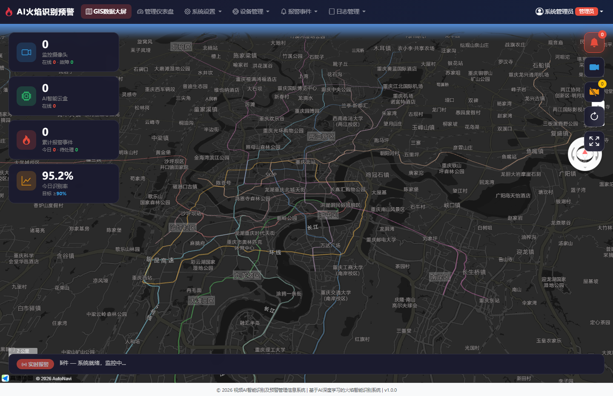

- 深色渐变背景 + 粒子漂浮动画
- 火焰Logo闪烁效果
- 管理员/处理员双角色快捷登录按钮
- 24小时 JWT Token 认证

---

### 2. GIS数据大屏（首页）
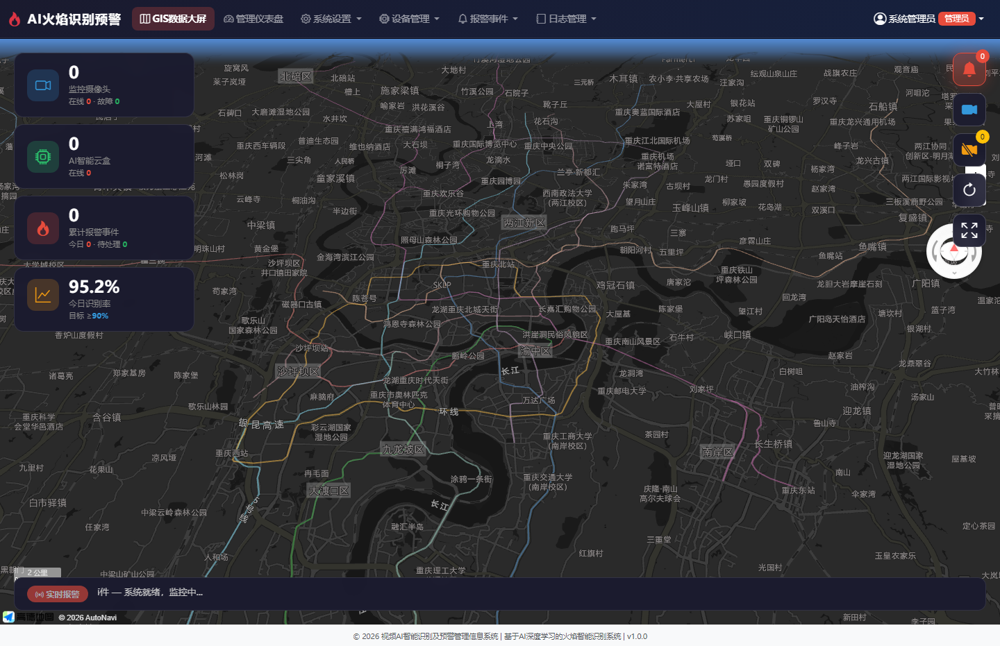

- **高德3D暗色地图**，默认定位重庆市
- 左侧统计面板：监控摄像头、AI云盒、累计报警、今日识别率
- 右上角功能按钮组：报警标记🔥、摄像头标记📷、故障标记⚠、刷新、全屏
- 底部实时报警滚动条
- 点击标注弹出详细信息窗体

---

### 3. 管理仪表盘
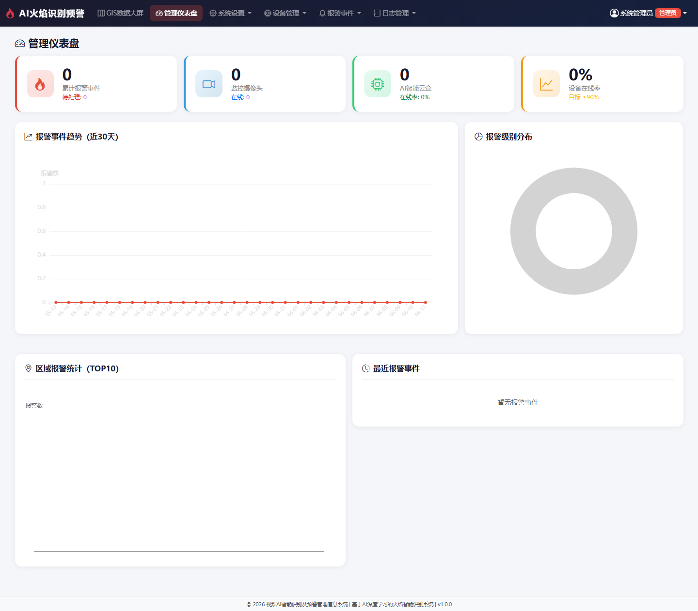

- 4个统计卡片（累计报警、监控摄像头、AI云盒、设备在线率）
- ECharts 近30天报警趋势折线图
- ECharts 报警级别分布饼图
- ECharts 区域报警统计柱状图（TOP10）
- 最近报警事件列表

---

### 4. 系统配置页面
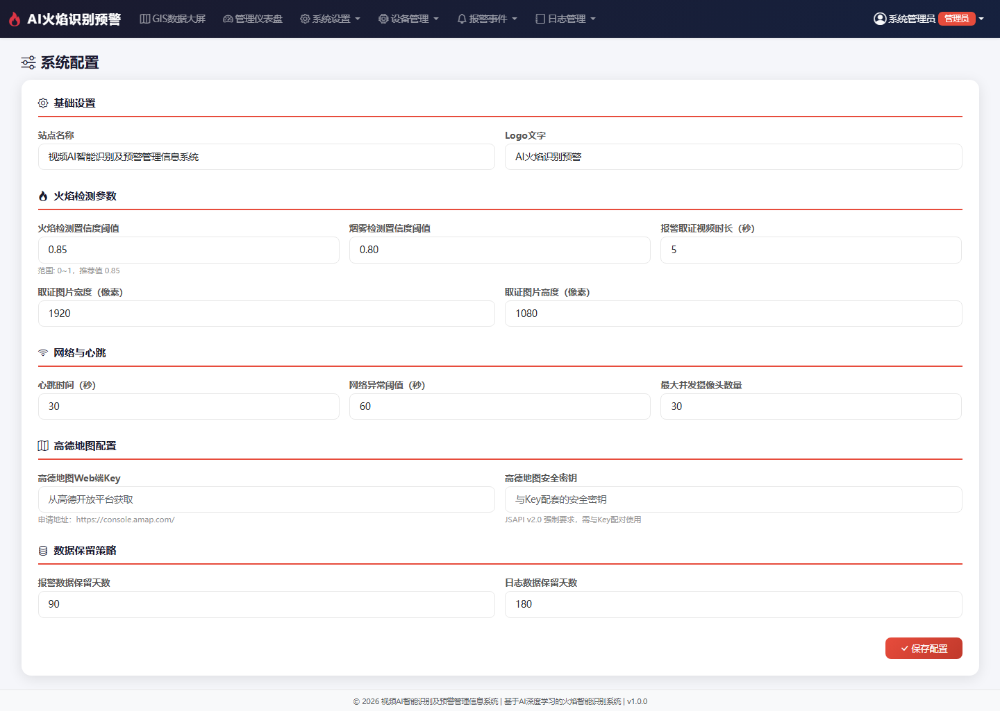

- **基础设置**：站点名称、Logo文字
- **火焰检测参数**：火焰置信度阈值、烟雾阈值、取证视频时长、图片尺寸
- **网络与心跳**：心跳间隔、网络异常阈值、最大并发摄像头数
- **高德地图配置**：Web端Key、安全密钥
- **数据保留策略**：报警/日志数据保留天数

---

### 5. 部门管理页面
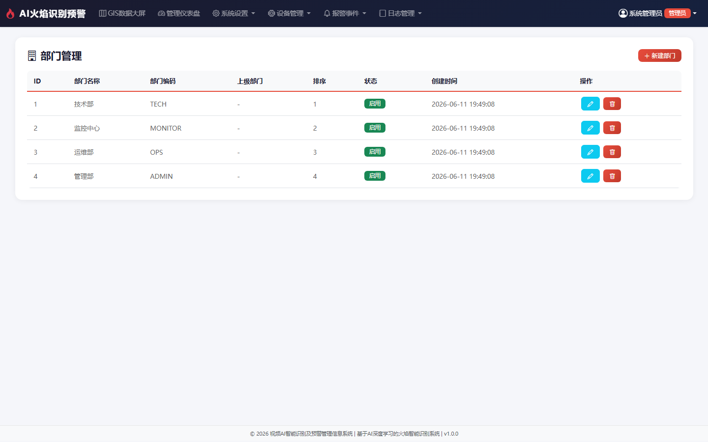

- 部门树形结构（支持父子层级）
- 新建/修改/删除操作
- 排序号管理、启用/禁用状态切换

---

### 6. 用户管理页面
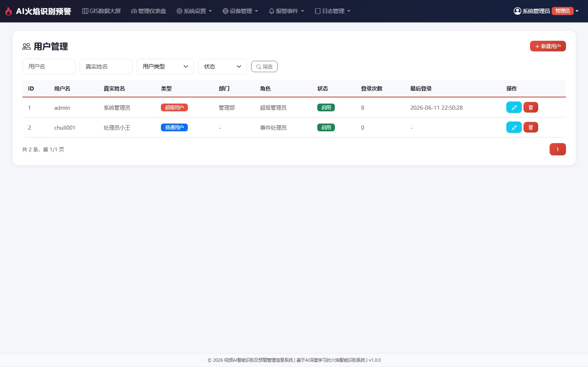

- 多条件筛选：用户名、真实姓名、用户类型、状态
- 分页展示
- 新建/修改弹窗：用户名、密码、真实姓名、邮箱、手机、类型、部门、角色
- 超级用户 / 普通用户双角色

---

### 7. 角色管理页面
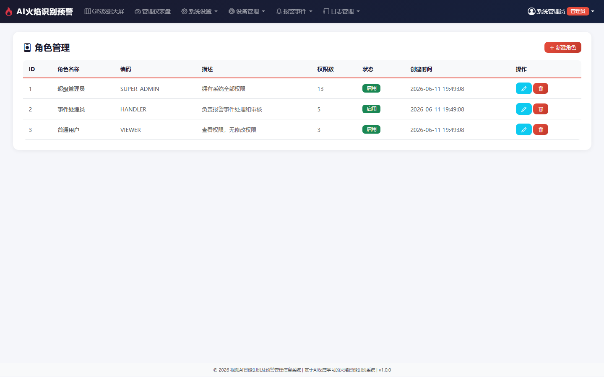

- 角色增删改查
- 权限复选框设置（14项权限）：
  - 系统设置（5项）：配置/部门/用户/角色/数据字典
  - 设备管理（3项）：云盒管理/摄像头管理/设备查看
  - 报警事件（4项）：报警事件/事件审核/摄像头故障/云盒故障
  - 日志管理（3项）：访问日志/操作日志/日志查看

---

### 8. 摄像头管理页面
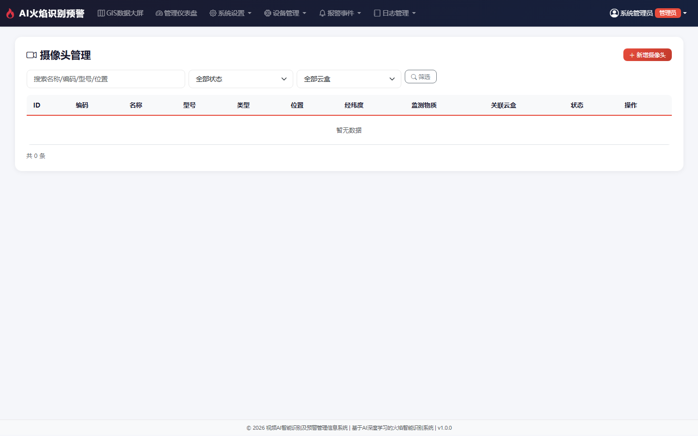

- 多条件筛选：名称/编码/型号/位置、状态、关联云盒
- 新增/修改弹窗（完整字段）：
  - 设备编码、名称、型号、类型
  - IP地址、端口、RTSP地址、分辨率、帧率
  - PTZ云台支持、监测物质
  - **经纬度坐标**、海拔、视野范围
  - 关联AI云盒、现场照片URL

---

### 9. AI智能云盒管理页面
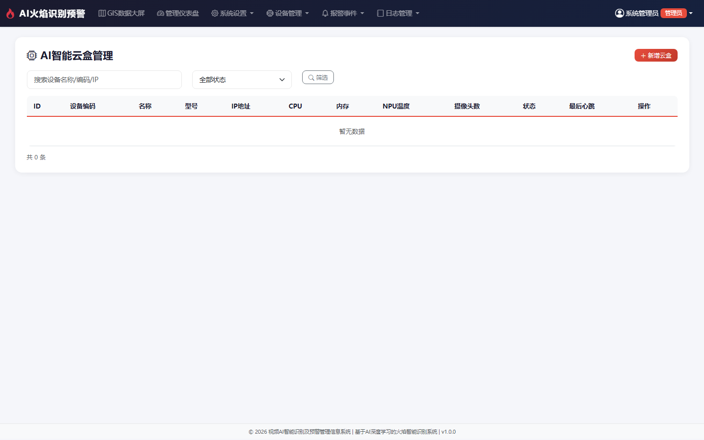

- 设备监控列表：编码、名称、型号、IP、CPU/内存/NPU温度
- 关联摄像头数量统计
- 在线状态实时监控（在线🟢/离线⚪/故障🔴/维护中）
- 最后心跳时间显示

---

### 10. 报警事件管理页面
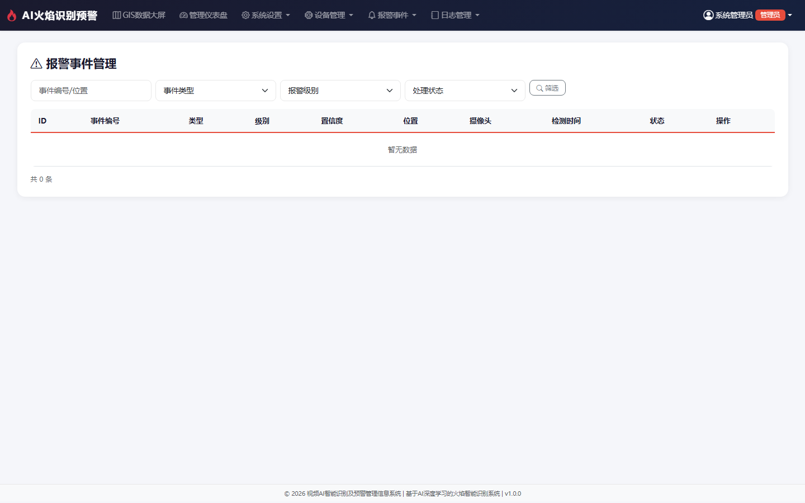

- 多条件查找：事件编号/位置、事件类型、报警级别、处理状态
- 事件详情弹窗：含经纬度坐标、置信度、位置描述、关联设备
- 火焰报警🔴 / 烟雾报警🟡 / 设备异常🔵 分类

---

### 11. 事件处理审核页面
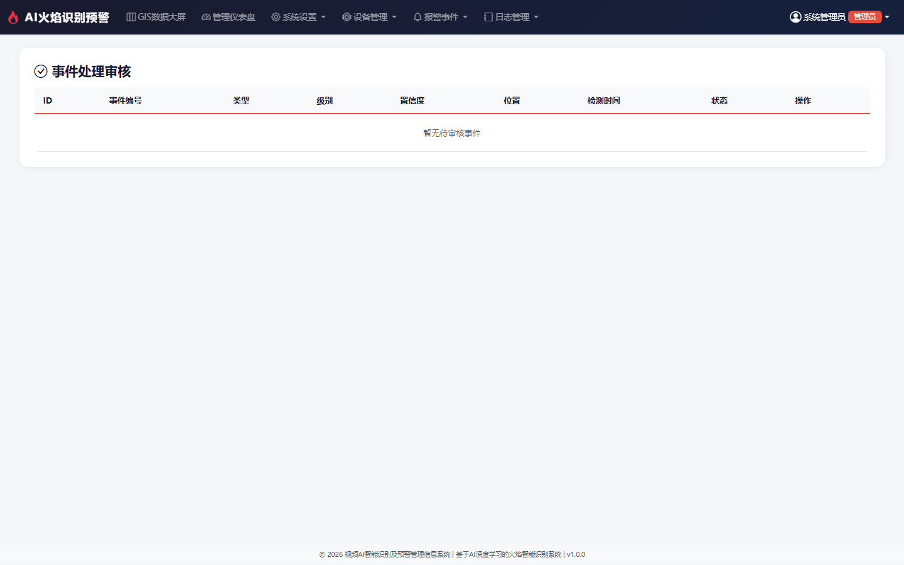

- 待处理/处理中事件列表
- **审核通过** / **审核驳回** 操作
- 处理备注填写
- 处理后记录处理人和处理时间

---

## 快速启动

```bash
# 1. 克隆仓库
git clone https://github.com/DlcFox/AIFlameUI.git
cd AIFlameUI

# 2. 创建虚拟环境并安装依赖
python -m venv .venv
source .venv/Scripts/activate  # Windows
pip install -r requirements.txt

# 3. 启动应用
python app.py

# 4. 浏览器访问
# GIS数据大屏: http://127.0.0.1:5000/
# 管理仪表盘: http://127.0.0.1:5000/dashboard
# 登录页面:   http://127.0.0.1:5000/login
```

### 默认账号

| 角色 | 用户名 | 密码 |
|------|--------|------|
| 超级管理员 | admin | 123456 |
| 事件处理员 | chuli001 | 123456 |

---

## 技术栈

| 技术 | 版本 | 用途 |
|------|------|------|
| Python Flask | 3.1 | Web应用框架 |
| SQLAlchemy | 2.0 | ORM数据库 |
| Bootstrap | 5.3 | 响应式UI框架 |
| LayUI | 2.9 | UI组件库 |
| ECharts | 5.5 | 数据可视化图表 |
| 高德地图 JSAPI | v2.0 | GIS地图展示（**1.1新版**） |
| PyJWT | 2.9 | JWT鉴权认证 |

---

*本仓库为"视频AI智能识别及预警管理信息系统"的前端开发分支，由人员C（段林川）负责开发与维护。*
