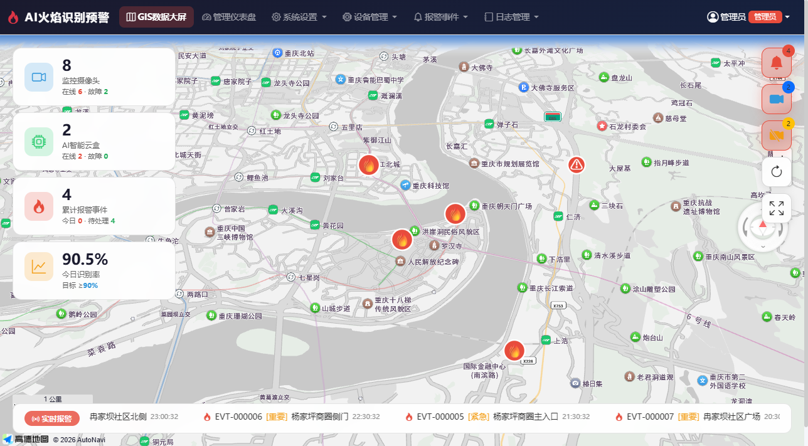
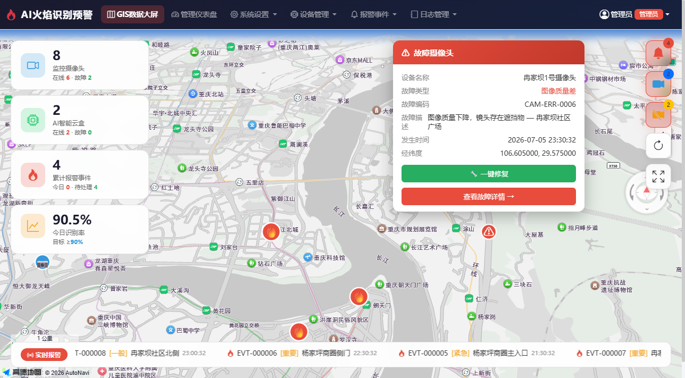
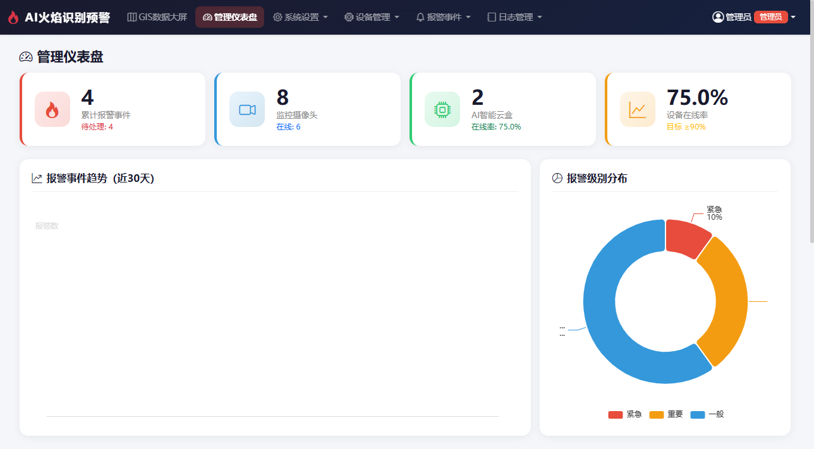
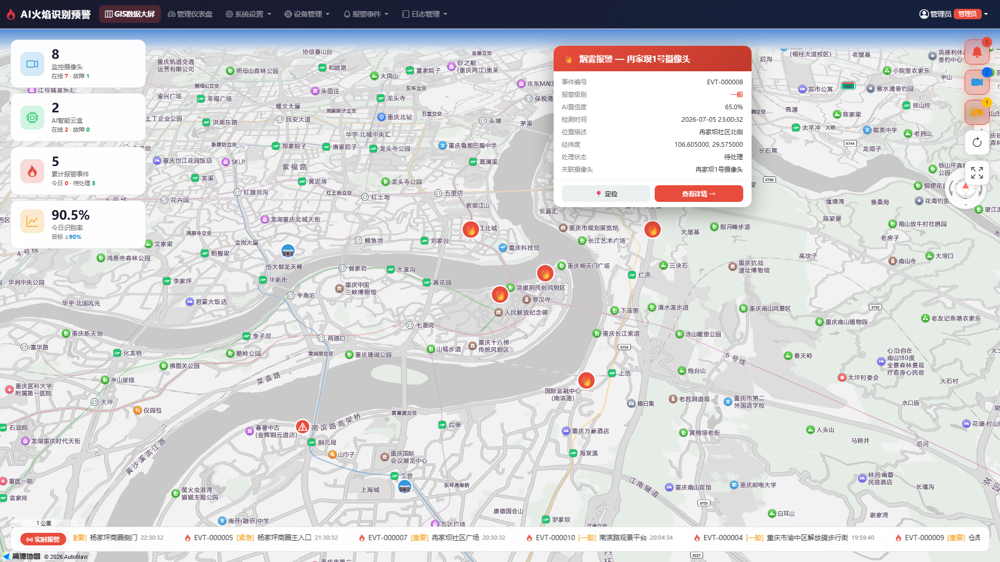
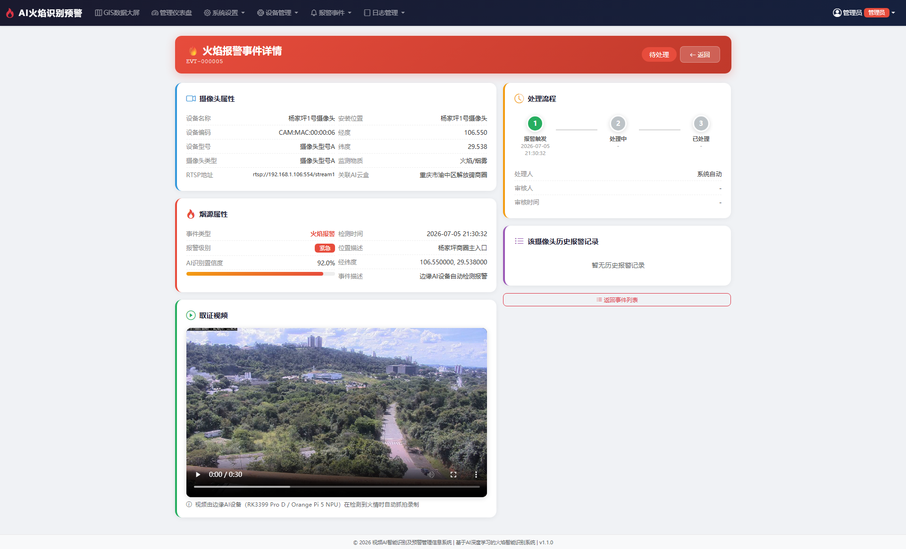
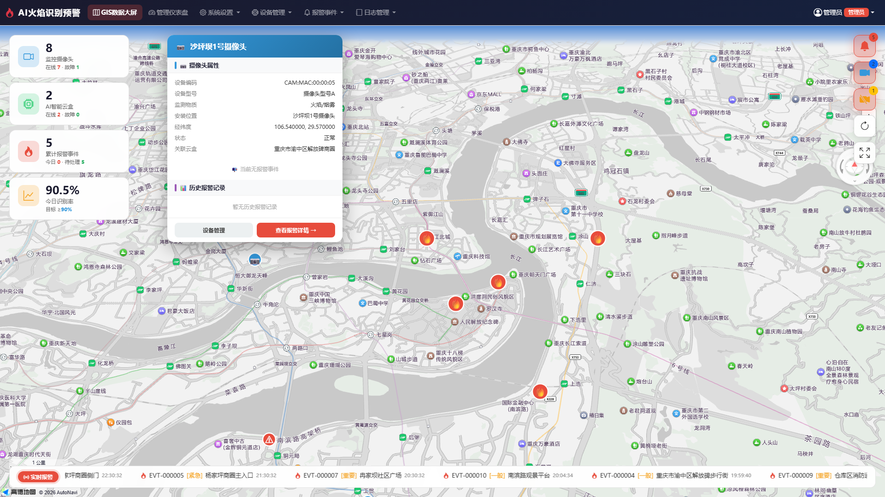
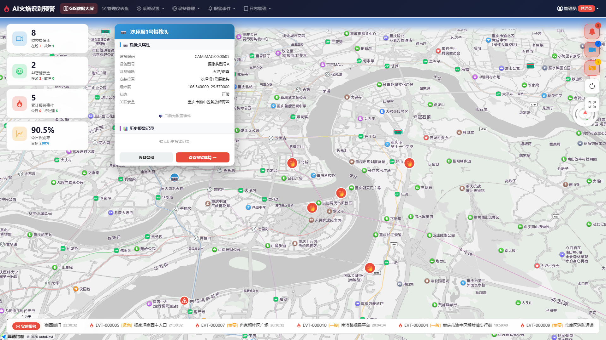

# 视频AI智能识别及预警管理信息系统 — 火焰识别

> **FlameDetection_1.1** | 融合架构：Flask → PHP API → MySQL | 高德地图GIS数据大屏 | 地图弹窗增强

---

## 人员信息

| 角色 | 姓名 | 工号 |
|------|------|------|
| 人员C · 前端开发与质量保障 | **段林川** | **12309040309** |
| 人员B · 后端API桥接 | 王永林 | — |
| 人员A · AI边缘检测 | 郭俊奇 | — |

---

## 版本信息

| 项目 | 内容 |
|------|------|
| **当前版本** | FlameDetection_1.1 |
| **创建时间** | 2026-06-11 |
| **上传时间** | 2026-07-06 |
| **分支** | `abc/duanlinchuan/FlameDetection_1.1` |

---

## 架构概览

```
┌─────────────────────┐     RTSP视频流      ┌──────────────────────────┐
│   摄像头 (海康/大华)  │ ─────────────────→  │  Orange Pi 5 (RK3588S)   │
│                     │                     │  YOLO11-nano NPU 推理    │
└─────────────────────┘                     └────────────┬─────────────┘
                                                         │ HTTP POST
                                                         ↓
┌──────────────────────────────────────────────────────────────────────┐
│  后端服务器 (B+C 融合)                                                 │
│  ┌─────────────────┐   API桥接    ┌──────────────────────────┐        │
│  │ Flask :5000      │ ←──────────→ │ PHP :8080 (CodeIgniter 3)│        │
│  │ 前端页面 / 代理   │             │ RESTful API / 数据库      │        │
│  └─────────────────┘             └──────────┬───────────────┘        │
│                                             │                         │
│                                     ┌───────▼────────┐               │
│                                     │ MySQL           │               │
│                                     │ flame_detection │               │
│                                     │ (15张表)         │               │
│                                     └────────────────┘               │
└──────────────────────────────────────────────────────────────────────┘
```

---

## FlameDetection_1.0 版本内容

### 1. GIS数据大屏 — 三层独立标记系统

基于高德地图 AMap JSAPI v2.0，3D视角，重庆市中心默认视野（zoom 14）。8个摄像头分散在四个象限，均可见。

**三层标记互不重叠覆盖：**

| 图层 | 图标 | 数量 | 说明 |
|------|------|------|------|
| 🔴 报警事件标记 | 红色🔥火焰 | **4** | 正常摄像头检测到火焰，变为此标记 |
| 🔵 监控摄像头标记 | 蓝色📷摄像头 | **2** | 正常运行，无报警无故障 |
| ⚠️ 故障摄像头标记 | 红色⚠警告 | **2** | 设备故障，无法检测火情 |

**交互功能：**
- 点击标记弹出详细信息窗口（设备信息、报警级别、故障描述等）
- 右侧按钮独立切换各图层显示/隐藏
- 徽章数字与地图实际标记数一一对应
- 底部实时报警滚动条

### 2. 左侧统计面板

| 统计项 | 说明 |
|--------|------|
| 监控摄像头（8） | 全部摄像头总数 |
| AI智能云盒（2） | 全部AI云盒 |
| 累计报警事件（4） | 按摄像头去重的报警事件数（非报警记录数） |
| 今日识别率 | 已处理/总报警比率 |

### 3. 故障摄像头智能处理

- **报警过滤**：故障摄像头的报警事件不计入统计面板（因摄像头损坏无法检测火情）
- **一键修复**：点击地图上的故障标记，弹出信息窗口显示"🔧 一键修复"按钮，点击即完成修复
- **自动恢复**：修复后故障标记消失→变为蓝色摄像头标记，其报警事件自动可见并计入统计
- 修复API链路：`地图JS → Flask PUT /api/v1/camera-faults/{id}/repair → PHP → MySQL DELETE`

### 4. 报警事件按摄像头去重

- 同一摄像头多条检测记录（如多次检测到火焰）归并为**1个报警标记**
- 累计报警事件 = 有报警的不同摄像头数
- 面板数字、按钮徽章、地图标记数三者完全一致

### 5. 设备管理后台

- 摄像头 CRUD（增删改查，含经纬度坐标）
- AI智能云盒管理
- 系统配置（高德地图Key/安全密钥、JWT密钥、报警阈值等）
- 用户/角色/部门/数据字典管理
- 报警事件审核（处理/驳回）
- 访问日志/操作日志

### 6. 边缘AI检测API

| 方法 | 路径 | 认证 |
|------|------|------|
| POST | `/api/detect/alarm` | X-API-Key |
| POST | `/api/detect/upload` | X-API-Key |
| POST | `/api/device/heartbeat` | X-API-Key |
| POST | `/api/device/error` | X-API-Key |

---

## FlameDetection_1.1 版本新增内容

> **核心更新**：报警事件详情页 + 地图弹窗增强 + 取证视频接入

### 1. 报警事件标记弹窗（简洁版）

点击地图上的红色🔥火焰标记，弹出简洁信息窗口：

| 信息项 | 说明 |
|--------|------|
| 事件编号 | 如 EVT-000005 |
| 报警级别 | 紧急 / 重要 / 一般 / 提示 |
| AI置信度 | 如 92.0% |
| 检测时间 | 边缘AI检测到火情的时间 |
| 位置描述 | 逆地址解析的位置信息 |
| 经纬度 | GPS 坐标（6位小数） |
| 处理状态 | 待处理 / 处理中 / 已处理 |
| 关联摄像头 | 触发报警的摄像头名称 |

底部操作栏：📍 地图定位 + **查看详情 →**（跳转到完整详情页）。

### 2. 报警事件详情页 `/alarm/detail/<id>` ★ 核心新增

点击弹窗中的"查看详情 →"按钮，跳转到完整的报警事件详情页面，包含五个区域：

| 区域 | 内容 |
|------|------|
| **页头** | 火焰/烟雾报警事件详情标题 + 事件编号 + 处理状态徽章 |
| **📷 摄像头属性** | 设备名称、编码、型号、类型、RTSP地址、安装位置、经纬度、监测物质、关联AI云盒 |
| **🔥 烟源属性** | 事件类型、报警级别、AI置信度（含进度条）、检测时间、位置描述、事件描述 |
| **🎬 取证视频** | HTML5 `<video>` 播放器，播放边缘设备（RK3399 Pro D / Orange Pi 5 NPU）抓拍的取证视频 |
| **📋 处理流程** | 三步时间线：①报警触发 → ②处理中 → ③已处理，含各节点时间戳、处理人、审核人、处理备注 |
| **📊 历史报警** | 该摄像头所有已处理的历史报警记录表格：时间、类型（火焰/烟雾）、置信度、处理状态 |

→ 详情页路由：`routes/main.py` → `alarm_event_detail()` | 模板：`templates/alarm/detail.html`

### 3. 摄像头标记弹窗增强（图21/22）

点击蓝色📷摄像头标记，弹出增强信息窗口：

| 区域 | 内容 |
|------|------|
| **摄像头属性** | 设备编码、型号、安装位置、经纬度、关联云盒 |
| **当前报警信息** | （如有报警）烟源属性 + 取证视频 + 处理流程时间线 |
| **历史报警记录** | 表格：时间、类型、置信度、状态 |

### 4. 取证视频接入

- 7个测试视频（VP*.mp4）通过 Flask 静态文件服务提供
- 访问路径：`/static/videos/VP*.mp4`
- 所有现有报警事件已关联对应取证视频
- 视频来源：边缘AI设备在检测到火情时自动抓拍录制

### 5. 数据库补充

| 新增内容 | 说明 |
|----------|------|
| 取证视频URL | 为14条报警事件填充 `Picture` 和 `VideoUrl` 字段 |
| 历史报警数据 | 新增4条历史报警记录（status=已处理），用于详情页历史列表 |
| 单条报警API | PHP API新增 `GET /alarm/events/<id>` 接口 |
| 种子脚本 | `sql/004_seed_videos.sql` |

---

## 界面截图

> 登录地址：`http://127.0.0.1:5000/`，账号：`admin / 123456`

### 数据大屏全貌



> 左侧面板：监控摄像头(8)、AI云盒(2)、累计报警事件(4)、识别率。右侧按钮：报警标记(4)、摄像头标记(2)、故障标记(2)。地图上8个标记分散重庆市区，三层互不覆盖：4个🔥火焰（报警事件）、2个📷蓝色（正常监控）、2个⚠警告（故障摄像头）。

### 故障摄像头标记 + 一键修复



> 点击地图上杨家坪/冉家坝的红色⚠故障标记，弹出信息窗口。显示设备名称、故障类型、故障编码、故障描述、发生时间、经纬度。底部绿色 **🔧 一键修复** 按钮直接修复故障，修复后页面自动刷新，报警恢复可见。

### 管理后台仪表盘



> ECharts 可视化统计面板：30天报警趋势折线图、报警级别分布饼图、区域报警统计柱状图（TOP 10）。顶部统计卡片：累计报警事件、监控摄像头、AI智能云盒、设备在线率。

### FlameDetection_1.1 新增：报警标记弹窗（简洁版）



> 点击红色🔥报警标记，弹出**简洁信息窗口**：事件编号、报警级别、AI置信度、检测时间、位置描述、经纬度、处理状态、关联摄像头。底部按钮：📍 定位 + **查看详情 →**（跳转到完整详情页）。

### FlameDetection_1.1 新增：报警事件详情页



> 点击"查看详情 →"后跳转到的完整详情页 `/alarm/detail/<id>`。**摄像头属性**面板（左）：设备名称、编码、型号、RTSP地址、安装位置。**烟源属性**面板（左）：事件类型、报警级别、AI置信度进度条、检测时间。**取证视频**播放器（左）：HTML5视频播放。**处理流程**时间线（右）：报警触发→处理中→已处理，含处理人/审核人/备注。**历史报警记录**表格（右）：该摄像头所有已处理的历史报警。

### FlameDetection_1.1 新增：摄像头当前报警信息



> 点击蓝色📷摄像头标记，弹出窗口显示**摄像头属性** + **当前报警信息**（含烟源属性和取证视频）。

### FlameDetection_1.1 新增：摄像头历史报警记录



> 同一弹窗底部显示**历史报警记录表格**：时间、类型（火焰/烟雾）、置信度、处理状态。支持多条记录滚动查看。

---

## 技术栈

| 层级 | 技术 |
|------|------|
| 前端框架 | Flask + Jinja2 + Bootstrap 5 |
| 地图引擎 | 高德地图 AMap JSAPI v2.0 |
| 图表 | ECharts 5 |
| 后端桥接 | Python requests + JWT |
| 数据源 | PHP CodeIgniter 3 (端口8080) |
| 数据库 | MySQL 8.0 (flame_detection, 15表) |
| 边缘AI | ONNX Runtime + YOLO11-nano (Orange Pi 5 NPU) |

---

## 快速启动

```bash
# 1. 启动PHP API服务（Python替代版，端口8080）
python php_alt_server.py

# 2. 初始化数据库（首次运行）
python seed_data.py
python add_cameras.py
python add_faulty_cameras.py

# 3. 启动Flask应用（端口5000）
python app.py

# 4. 浏览器访问
# http://127.0.0.1:5000/
# 登录: admin / 123456
```

---

## 项目结构

```
FlameDetection/
├── app.py                 # Flask主应用入口
├── api_bridge.py          # PHP API桥接层（JWT + 字段映射）
├── php_alt_server.py      # Python替代PHP服务器（端口8080）
├── config.py              # 系统配置
├── models.py              # ORM模型定义
├── routes/
│   ├── __init__.py        # 蓝图注册
│   ├── main.py            # 页面路由（GIS大屏 / 仪表盘）
│   ├── api.py             # RESTful API（/api/v1/）
│   ├── auth.py            # 认证路由
│   └── detect.py          # 边缘AI检测API
├── templates/
│   ├── index.html         # GIS数据大屏（核心页面）
│   ├── dashboard.html     # 管理仪表盘
│   └── ...                # 设备/报警/系统管理模板
├── static/
│   ├── css/app.css
│   ├── js/app.js
│   └── lib/               # Bootstrap / ECharts / LayUI
├── seed_data.py           # 数据库初始化种子
├── add_cameras.py         # 添加正常摄像头
├── add_faulty_cameras.py  # 添加故障摄像头 + 报警事件
├── test_all.py            # 集成测试
└── README.md
```

---

## 里程碑

| 阶段 | 内容 | 分支 |
|------|------|------|
| M1-M4 | 数据库设计、基础API、文档导出 | `backend/wangyonglin` |
| M5 | 安全加固 + 前端页面 | `fusion/backend-frontend` |
| M6 | B+C 前后端融合 (Flask↔PHP桥接) | `fusion/backend-frontend` |
| M7 | A+B+C 三方融合 (边缘AI集成) | `fusion/abc-integration` |
| **1.0** | **故障摄像头标记 + 报警过滤 + 一键修复 + 去重统计** | **`abc/duanlinchuan/FlameDetection_1.0`** |
| **1.1** | **报警详情页 + 弹窗增强 + 取证视频 + 处理流程时间线** | **`abc/duanlinchuan/FlameDetection_1.1`** |

---

> 开发环境: Windows 11 · Python 3.13 · MySQL 8.0 · Flask 3.1 · CodeIgniter 3
