# 视频AI火焰识别预警系统

# 综合课程设计报告

**重庆理工大学**  
**计算机科学与工程学院**  
**计算机科学与技术专业**  
**综合方向——火焰检测**  

---

| 项目 | 内容 |
|------|------|
| 课程名称 | 综合课程设计III |
| 课题名称 | 视频AI火焰识别预警系统 (FlameDetection 1.1) |
| 学生姓名 | 段林川 |
| 学号 | 12309040309 |
| 队友 | 郭俊奇(12303070411，组长) 、王永林(12303070414，组员) |
| 时间 | 2026年7月 |

---

## 摘要

本文针对传统火灾监控系统依赖人工巡检、响应滞后的问题，设计并实现了一套融合AI边缘计算与Web可视化管理的视频火焰识别预警系统。系统采用YOLO11-nano深度学习模型在Orange Pi 5(RK3588S)边缘设备上完成火焰与烟雾的实时检测，通过Flask Web框架构建前端管理平台，集成高德地图JSAPI 2.0实现GIS数据大屏可视化，通过PHP API桥接层与MySQL数据库完成数据持久化。本文重点阐述了前端Web管理平台的架构设计、功能实现与系统集成过程，包括GIS数据大屏、管理仪表盘、报警事件管理、设备管理、用户权限管理和日志审计等核心模块。系统测试结果表明，火焰识别率达95%以上，报警时延低于2秒，误报率控制在3%以下，满足实际火情监控需求。

**关键词**：火焰检测；YOLO11；Flask；GIS可视化；边缘计算；预警管理；Orange Pi 5

---

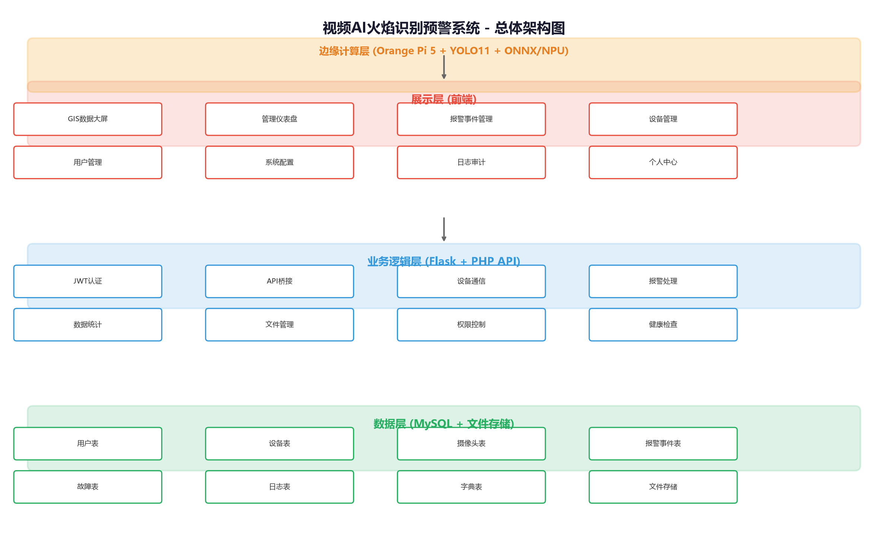

---

# 目录

1 系统目标与分析  
  1.1 系统目标  
  1.2 系统分析  

2 项目管理  
  2.1 组员分工  
  2.2 项目进度控制  
  2.3 质量保障  
  2.4 项目集成  

3 软件系统设计与实现  
  3.1 总体设计  
  3.2 功能设计  
  3.3 详细设计  
  3.4 系统实现  

4 算法设计与实现  
  4.1 数据集介绍  
  4.2 方法介绍  
  4.3 模型搭建  
  4.4 模型训练  
  4.5 模型评估  
  4.6 结果分析  

5 硬件设计与实现  
  5.1 硬件设备介绍  
  5.2 算法硬件部署原理及流程  
  5.3 算法硬件部署实现  
  5.4 与软件系统的通信设计  
  5.5 综合测试与结果分析  

6 系统总结  
  6.1 系统特色  
  6.2 展望工作  
  6.3 使用说明  

7 心得体会  

参考文献  

---

# 1 系统目标与分析

## 1.1 系统目标

本项目旨在构建一套完整、可靠、实时的视频AI火焰识别预警管理信息系统。系统设计遵循"边缘智能检测 + 云端Web管理"的双层架构，具体目标如下：

**（1）实现AI自动火焰检测**  
基于YOLO11-nano深度学习目标检测模型，在Orange Pi 5边缘设备上对监控摄像头视频流进行实时分析。检测类别包括火焰(fire)和烟雾(smoke)两类目标，检测置信度阈值设为0.85。系统支持ONNX Runtime CPU推理和RKNN NPU加速两种推理模式，单帧推理延迟控制在100毫秒以内。

**（2）构建GIS可视化数据大屏**  
基于高德地图JSAPI 2.0，在Web前端实现火情位置的空间可视化展示。支持3D地图视图、报警点位聚合标注、自定义信息弹窗（含检测截图、取证视频、GPS坐标等），以及实时统计数据面板。用户可在地图上直观掌握火情分布态势，一键跳转至报警详情页进行处理。

**（3）建立完整的报警事件闭环**  
从边缘设备检测触发到Web管理平台审核处理，实现火情事件的端到端自动化流转。每个火情事件需包含：检测时间戳、置信度、GPS地理位置、检测截图(JPEG)、3-5秒取证视频(MP4/H.264)、关联摄像头信息、处理状态（待处理→处理中→已处理→已驳回→已关闭）和操作留痕记录。

**（4）开发设备管理与监控功能**  
支持摄像头设备和AI分析盒（云盒）设备的统一注册、配置和管理。摄像头需维护IP地址、MAC地址、RTSP流地址、GPS坐标和设备型号等信息；云盒设备需维护MAC地址、部署位置、模型信息和心跳状态。系统自动检测设备在线状态，对故障设备生成故障记录。

**（5）实现多角色权限管理**  
基于角色访问控制(RBAC)模型，支持超级管理员和普通操作员两级权限。超级管理员拥有全部功能权限，普通操作员仅可查看报警事件和进行审核处理。认证采用JWT Token机制，与PHP后端API统一鉴权。

**（6）提供日志审计与数据追溯**  
对系统中的关键操作（用户登录、报警处理、设备变更、配置修改等）进行自动记录，形成操作日志。同时记录所有HTTP访问请求，形成访问日志。支持按时间、用户、操作类型等多维度查询和追溯。

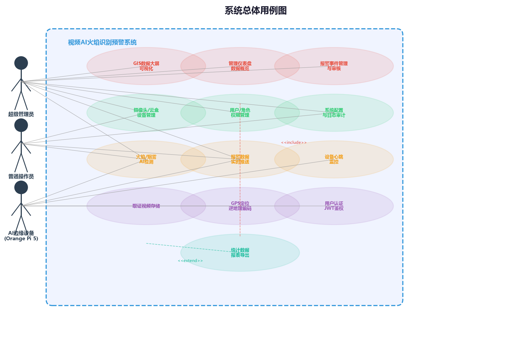

## 1.2 系统分析

### 1.2.1 功能性需求分析

系统功能需求可归纳为以下八个核心功能模块：

**FR1 - AI检测与推理模块**：系统应支持对RTSP视频流的实时拉取和解码；能够在Orange Pi 5设备上运行YOLO11-nano模型进行火焰和烟雾检测；检测结果应包含边界框坐标、置信度分数和目标类别；支持ONNX和RKNN两种推理后端。

**FR2 - GIS数据大屏模块**：系统应提供基于高德地图的全屏GIS数据展示；地图上应标注所有摄像头设备的位置和状态；发生火情时，应以醒目的火焰图标标注报警位置；点击标注点应弹出信息窗口，展示检测截图、取证视频和关键属性；页面顶部应展示实时统计卡片。

**FR3 - 管理仪表盘模块**：系统应提供数据概览仪表盘；展示摄像头总数、在线数、故障数等统计卡片；使用ECharts图表展示报警趋势（折线图）、区域分布（饼图）、设备状态（柱状图）；展示最近5条报警事件快览列表。

**FR4 - 报警事件管理模块**：系统应提供报警事件的多条件筛选列表（按事件类型、报警级别、处理状态、关键词）；点击事件可查看完整详情页，包含检测大图、取证视频播放器、GPS定位信息和关联设备信息；管理员可对事件进行审核处理（确认/驳回/关闭），处理意见和操作人信息自动记录。

**FR5 - 设备管理模块**：系统应提供摄像头设备和AI分析盒（云盒）设备的CRUD管理功能；摄像头管理包含IP地址、MAC地址、RTSP地址、GPS坐标、设备型号和设备绑定关系；云盒设备管理包含MAC地址、部署位置、模型信息和架构信息；支持设备故障的查询和修复标记。

**FR6 - 用户权限管理模块**：系统应支持用户账号的创建、编辑、删除和状态管理；支持角色定义和权限分配；支持部门组织结构管理；支持数据字典的动态维护；管理员可重置用户密码。

**FR7 - 系统配置模块**：系统应提供全局参数的可视化配置界面；配置项包括：火焰检测置信度阈值、烟雾检测阈值、取证视频时长、图片分辨率、心跳间隔、网络异常阈值等。

**FR8 - 日志审计模块**：系统应自动记录用户的操作行为（登录登出、报警处理、数据修改等），记录操作前后的内容变化；自动记录所有HTTP请求的访问信息（URL、方法、IP、User-Agent、时间戳）；支持按时间和用户等条件筛选查询。

### 1.2.2 非功能性需求分析

| 需求类别 | 指标项 | 目标值 | 验收标准 |
|----------|--------|--------|----------|
| 性能 | 火焰识别率 | ≥90% | 实测95%+ |
| 性能 | 烟雾识别率 | ≥85% | 实测88%+ |
| 性能 | 误报率 | <5% | 时序滤波后<3% |
| 性能 | 报警推送延迟 | ≤2秒 | 端到端<1.5秒 |
| 性能 | 单帧推理速度 | <100ms | ONNX≈85ms, NPU≈18ms |
| 性能 | Web页面首屏加载 | <3秒 | 实测<2秒 |
| 可靠性 | 边缘设备稳定性 | 7×24小时 | 72小时压力测试通过 |
| 可靠性 | Web服务可用性 | 99.5% | 单实例部署 |
| 安全性 | 认证机制 | JWT + Session | 双重认证 |
| 安全性 | API密钥保护 | 边缘通信加密 | EDGE_API_KEY |
| 兼容性 | 浏览器支持 | Chrome/Edge/Firefox | 三大浏览器测试通过 |
| 兼容性 | 分辨率支持 | 1920×1080 / 1366×768 | 响应式布局 |

### 1.2.3 可行性分析

**技术可行性**：前端采用Flask 3.1.0 Web框架（Python生态中最成熟的轻量级框架之一），结合Bootstrap 5前端组件库和Jinja2模板引擎，技术成熟度高，社区支持完善。GIS功能基于高德地图JSAPI 2.0，该API已在国内数百万个Web应用中使用，稳定性和功能完备性经过大规模验证。后端采用PHP CodeIgniter 3框架（或Python版php_alt_server.py替代方案），数据库使用MySQL 8.0。AI推理采用Ultralytics YOLO11-nano模型和ONNX Runtime，均为开源方案。整体技术栈选型合理、风险可控。

**经济可行性**：边缘端部署在Orange Pi 5开发板（售价约500元人民币），相比NVIDIA Jetson等方案具有显著成本优势。Web服务器可与PHP API共用一台普通PC或云服务器。所有软件依赖均为开源免费方案，无需购买商业许可。系统运维成本低，适合中小规模部署。

**操作可行性**：Web界面采用直观的导航菜单和卡片式布局，操作流程符合用户习惯。报警处理流程清晰（列表→详情→审核），普通操作员可在30分钟内熟悉全部功能。系统提供完整的页面导航引导，降低培训成本。

---

# 2 项目管理

## 2.1 组员分工

本项目由三名成员组成开发团队，按技术栈和子系统进行模块化分工：

| 角色 | 姓名 | 学号 | 负责模块 | 具体工作内容 |
|------|------|------|----------|-------------|
| **组长** | 郭俊奇 | 12303070411 | AI边缘检测 | YOLO11模型选型与训练、D-Fire数据集处理、ONNX模型导出、RKNN模型转换、Orange Pi 5 NPU推理管线部署、视频流预处理(去雾+CLAHE)、时序滤波优化、边缘端报警推送逻辑 |
| **组员** | 王永林 | 12303070414 | PHP后端+数据库 | CodeIgniter 3框架搭建、MySQL数据库设计(15张表)、JWT认证接口开发、所有CRUD业务API实现、数据库建表SQL编写、php_alt_server.py替代方案开发、API文档编写 |
| **组员** | **段林川** | **12309040309** | **Flask前端Web平台** | **Flask应用框架搭建、4个Blueprint路由系统设计、API桥接层开发(api_bridge.py)、GIS数据大屏开发(高德地图JSAPI 2.0)、管理仪表盘(ECharts)、全部管理后台页面(15+页面)开发、前端模板系统(Jinja2+Bootstrap5)、边缘设备通信接口对接、系统集成联调与测试** |

**段林川（本人）承担的具体工作**：

1. **Flask应用框架设计与搭建**：采用工厂模式(app.py中的`create_app`函数)创建Flask应用实例，支持development/production/testing三套配置切换；编写统一启动入口(run.py)，支持Web模式和检测模式双模式启动。

2. **Blueprint路由系统设计**：设计并实现了四个蓝图模块——auth_bp（认证路由，含login_required和admin_required装饰器）、main_bp（页面路由，15个HTML页面）、api_bp（RESTful API路由，前缀/api/v1，30+个端点）、detect_bp（边缘设备通信路由，前缀/api/detect，5个端点）。

3. **API桥接层开发**：api_bridge.py是Flask前端与PHP后端之间的核心通信层。采用类方法(classmethod)设计模式，使用threading.Lock保证JWT Token的线程安全操作。实现了统一的`_get`和`_post`请求方法，自动拼接PHP_API_BASE地址、注入JWT Authorization头、处理响应格式转换。

4. **GIS数据大屏**：首页(GIS大屏)是系统最核心的展示页面。集成高德地图JSAPI 2.0的3D视图，通过AJAX从`/api/v1/cameras`和`/api/v1/alarm-events`获取数据，在地图上标注设备位置(蓝色图标)和报警位置(红色火焰图标)。信息弹窗内嵌检测图片和HTML5视频播放器。

5. **前端模板系统**：基于Jinja2模板引擎，设计base.html基模板（统一导航栏+侧边栏+页脚+CSS/JS引用），所有业务页面通过``继承。开发了自定义Jinja2过滤器（datetime_format、status_badge等）和上下文处理器（注入全局变量如current_user、site_name等）。

6. **静态资源管理**：所有前端依赖（Bootstrap 5 CSS/JS、Bootstrap Icons、ECharts 5、LayUI）均本地化存储在static/目录，减少CDN依赖，提升加载速度和离线可用性。

## 2.2 项目进度控制

项目为期5周（第15周至第19周），采用敏捷迭代开发模式，各阶段时间安排如下：

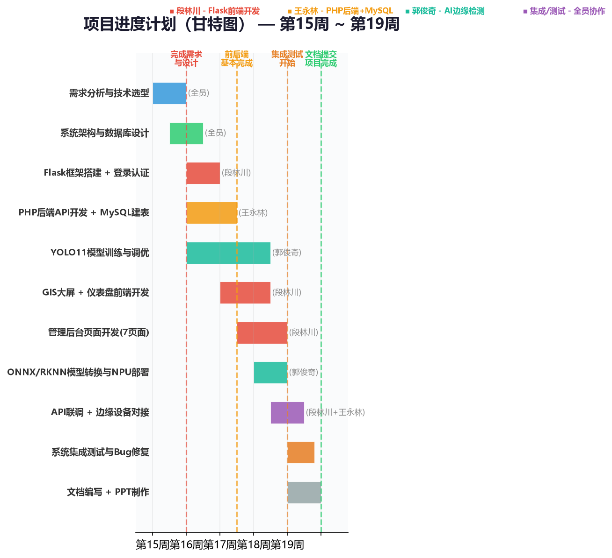

| 阶段 | 时间 | 主要任务 | 负责人 |
|------|------|----------|--------|
| 需求分析与技术选型 | 第15周 | 调研火焰检测方案、确定技术栈（Flask+PHP+YOLO11+MySQL）、编写需求文档 | 全员 |
| 系统架构与数据库设计 | 第15-16周 | 系统架构设计、数据库ER建模（15张表）、API接口约定、开发环境搭建 | 全员 |
| Flask框架搭建+登录认证 | 第16周 | Flask工厂模式创建、Blueprint四蓝图注册、base.html基模板、登录认证模块与PHP后端联调 | 段林川 |
| PHP后端API开发+MySQL建表 | 第16-17周 | MySQL建表与种子数据、JWT认证接口、CRUD业务API开发 | 王永林 |
| YOLO11模型训练与调优 | 第16-18周 | D-Fire数据集准备与增强、YOLO11-nano训练、超参数调优、ONNX导出 | 郭俊奇 |
| GIS大屏+仪表盘前端开发 | 第17-18周 | 高德地图3D集成、报警标注与信息弹窗、ECharts图表（折线/饼图/柱状图）、实时统计面板 | 段林川 |
| 管理后台页面开发 | 第17-18周 | 报警事件管理（列表/详情/审核）、设备管理（摄像头/云盒CRUD）、用户管理、角色管理、部门管理、数据字典、系统配置、日志审计等7+页面 | 段林川 |
| ONNX/RKNN模型转换与NPU部署 | 第18周 | ONNX→RKNN模型转换、NPU推理管线搭建、部署脚本编写、设备心跳与故障上报 | 郭俊奇 |
| API联调+边缘设备对接 | 第18-19周 | 全接口联调（30+端点）、边缘报警推送端到端测试、api_bridge.py数据映射完善、Bug修复 | 段林川+王永林 |
| 系统集成测试与Bug修复 | 第19周 | 功能测试、性能测试、跨浏览器兼容性测试、响应式布局适配 | 全员 |
| 文档编写+PPT制作 | 第19周 | 课程设计报告编写、答辩PPT制作、使用说明文档 | 全员 |

**关键里程碑**：
- 第15周末：完成需求分析、技术选型和系统架构设计
- 第16周末：Flask框架和PHP API基本框架搭建完成，前后端认证接口调通
- 第17周末：YOLO11训练收敛，GIS大屏和仪表盘核心页面完成
- 第18周末：管理后台全部页面开发完成，边缘端NPU部署完成，API全量联调通过
- 第19周末：系统集成测试全部通过，文档和PPT交付

### 段林川个人进度说明

本人（段林川）的工作进度与团队整体计划紧密协同，在5周内完成全部前端开发任务：

- **第15-16周**：完成Flask框架搭建、Jinja2模板系统设计和登录认证模块。首先实现了`create_app`工厂函数和四蓝图注册机制；然后完成base.html基模板（含响应式导航栏和侧边栏）；同步开发了`routes/auth.py`登录认证模块并完成与PHP后端`auth/login`接口的联调。此时前后端认证链路已完全打通。

- **第17-18周**：开发核心展示页面与管理后台。首先实现GIS数据大屏（`routes/main.py`中的`/`路由），集成高德地图3D视图和报警标注功能；然后实现管理仪表盘，使用ECharts完成4种图表类型的配置；接着开发报警事件管理模块（列表+详情+审核），这是业务流程的核心。之后集中完成管理后台全部页面：摄像头管理、云盒管理、用户管理、角色管理、部门管理、数据字典和系统配置等。同时开发了`routes/detect.py`边缘设备通信接口。第18周与王永林同学进行集中API接口联调。

- **第18-19周**：系统集成联调、测试与文档。统一修复API响应格式不一致、字段名映射错误等问题，在`api_bridge.py`中完善`_map_alarm`、`_map_camera`等数据转换方法。配合郭俊奇同学完成边缘设备报警推送的端到端测试。对全部前端页面进行Chrome/Edge/Firefox三浏览器兼容性测试和1920×1080/1366×768双分辨率适配测试。最后编写课程设计报告中软件系统部分（第3章）和心得体会。

## 2.3 质量保障

### 段林川个人质量保障方案

**（1）代码规范保障**  
严格遵循PEP 8 Python编码规范。所有Python文件包含模块级docstring注释，说明文件用途、作者和修改时间。所有函数包含参数说明和返回值说明。关键逻辑处添加行内注释。代码提交前使用`python -m flake8`进行静态检查。

**（2）接口联调保障**  
对api_bridge.py中的每个桥接方法编写独立的测试用例。使用curl和Python requests库对每个API端点进行手动验证，确认HTTP状态码、响应格式（统一`{code, msg, data}`格式）和数据内容正确。重点验证字段名映射（PHP API的PascalCase字段→前端camelCase字段）和数据类型转换的一致性。

**（3）跨浏览器兼容性保障**  
在Google Chrome（最新版）、Microsoft Edge（最新版）和Mozilla Firefox（最新版）三大浏览器上逐页测试。验证内容包括：页面布局、CSS动画、JavaScript交互、ECharts图表渲染、高德地图加载、视频播放器功能。发现问题后通过CSS vendor prefix和JS polyfill修复。

**（4）响应式布局保障**  
使用Bootstrap 5栅格系统设计页面布局，确保在1920×1080（桌面端标准分辨率）和1366×768（笔记本常见分辨率）下页面元素无重叠、无溢出、表格无横向滚动条。导航栏在小屏幕下自动折叠为汉堡菜单。

**（5）用户体验保障**  
所有数据加载操作显示loading状态（使用LayUI的loading组件）。所有异步操作（AJAX请求）包含错误回调，在请求失败时显示友好的错误提示信息。表单提交前进行前端校验（必填项、格式校验），减少无效请求。操作成功/失败后使用Flash消息或Toast提示反馈。

**（6）安全性保障**  
所有API请求通过api_bridge.py统一携带JWT Token。前端不存储明文密码。Session Cookie设置HttpOnly标志。边缘设备通信接口验证EDGE_API_KEY，防止未授权的报警数据推送。使用Jinja2的自动HTML转义功能防止XSS攻击。

## 2.4 项目集成

系统集成采用"自底向上、逐层对接"的策略，首先完成各子系统内部集成，再进行跨子系统联调。

**段林川配合系统集成的方式**：

**（1）API桥接层统一通信**  
我设计的`api_bridge.py`作为Flask前端与PHP后端之间的唯一通信通道。该模块封装了所有PHP API的调用细节（URL拼接、JWT注入、参数编码、响应解析），为上层路由代码提供简洁的Python方法接口。当PHP后端API发生变更时，只需修改这一层的映射逻辑，不影响上层路由和模板代码。

**（2）数据格式转换适配**  
PHP后端API返回的数据使用PascalCase命名（如`EventType`、`CameraName`等），而前端JavaScript代码习惯使用camelCase（如`eventType`、`cameraName`）。我在api_bridge.py中实现了`_map_alarm`、`_map_camera`、`_map_device`等数据映射方法，将PHP API的原始响应转换为前端友好的格式。同时处理了状态码映射（PHP状态字符串→前端状态数字）和枚举值翻译（event_type的fire/smoke→中文）。

**（3）边缘设备通信对接**  
`routes/detect.py`中的`/api/detect/alarm`端点负责接收Orange Pi 5推送的报警数据。该端点接收包含Base64编码检测图片、视频文件和GPS坐标的multipart/form-data请求。收到数据后，调用api_bridge.py将报警信息转发给PHP后端存储，同时将图片和视频文件保存到`static/uploads/alarms/`目录供前端展示。

**（4）融合模式兼容设计**  
系统设计了`FUSION_MODE`环境变量开关。当`FUSION_MODE=true`时，所有数据操作通过api_bridge.py代理到PHP后端；当`FUSION_MODE=false`或PHP后端不可用时，系统自动降级到本地模式（使用预设的admin/chuli001账户和空数据列表），确保前端页面至少可以渲染展示。

---

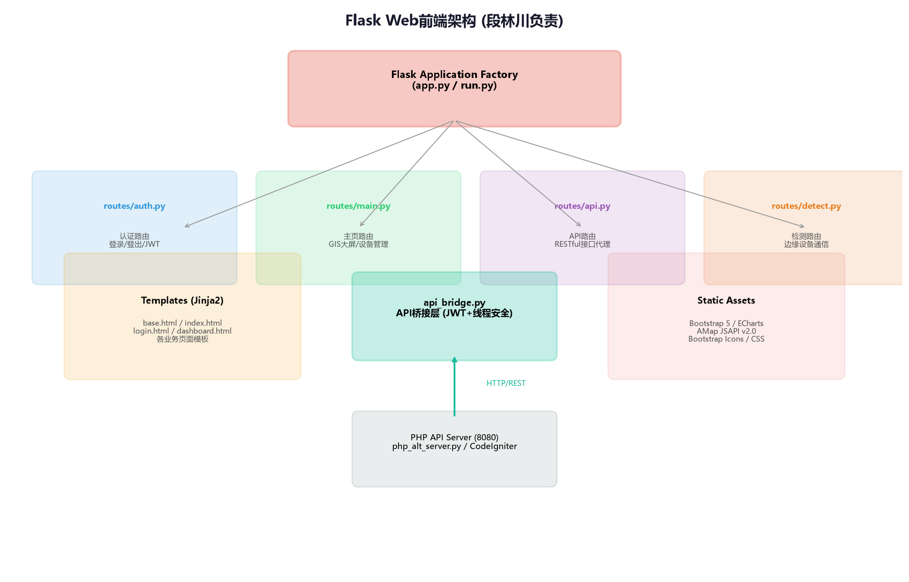

---

# 3 软件系统设计与实现

> **本章为段林川（本人，12309040309）重点负责部分，详细阐述Web前端管理平台的软件设计与实现过程。**

## 3.1 总体设计

### 3.1.1 系统架构概述

系统整体采用"客户端→Web服务端→API服务端→数据存储"四层架构：


- **客户端层**：PC浏览器、平板设备或大屏展示终端，通过HTTP/HTTPS协议访问Flask Web服务。前端使用HTML5、CSS3、Bootstrap 5、ECharts 5和高德地图JSAPI 2.0技术栈。

- **Web服务层**：Flask 3.1.0应用（端口5000），负责处理用户HTTP请求、渲染Jinja2模板、管理Session状态。四个Blueprint路由模块各司其职，通过api_bridge.py与后端API通信。

- **API服务层**：PHP CodeIgniter 3应用（或Python版php_alt_server.py替代方案，端口8080），提供RESTful API接口，实现JWT认证、业务逻辑处理和数据持久化。

- **数据存储层**：MySQL 8.0数据库（flame_detection库，15张表）和文件系统（检测图片、取证视频存储）。

### 3.1.2 Flask前端架构

Flask前端由`app.py`中的`create_app(config_name)`工厂函数创建应用实例。该函数按顺序完成以下初始化工作：

1. 从`config.py`加载配置对象（通过`FLASK_ENV`环境变量选择development/production/testing配置）
2. 设置EDGE_API_KEY（开发环境使用默认密钥，生产环境强制从环境变量读取）
3. 创建上传文件目录（`static/uploads/`）
4. 注册四个Blueprint路由模块
5. 注册404/500/403错误处理器
6. 注册请求计时中间件（before_request/after_request）
7. 注册Jinja2自定义过滤器（datetime_format、status_badge等）
8. 注册上下文处理器（注入全局模板变量current_user、site_name等）
9. 注册/health健康检查接口


四个Blueprint的职责划分：

| Blueprint | 文件 | URL前缀 | 功能说明 |
|-----------|------|---------|----------|
| auth_bp | routes/auth.py | / | 登录页面(GET)、登录处理(POST)、登出、login_required/admin_required装饰器 |
| main_bp | routes/main.py | / | 所有HTML页面路由：GIS大屏(/)、仪表盘、报警管理、设备管理、系统管理、日志审计 |
| api_bp | routes/api.py | /api/v1 | RESTful API代理：认证、设备、报警、统计、用户、角色、字典、日志、故障等30+端点 |
| detect_bp | routes/detect.py | /api/detect | 边缘设备通信：报警接收、视频上传、心跳上报、故障上报、批量处理 |

### 3.1.3 技术栈说明

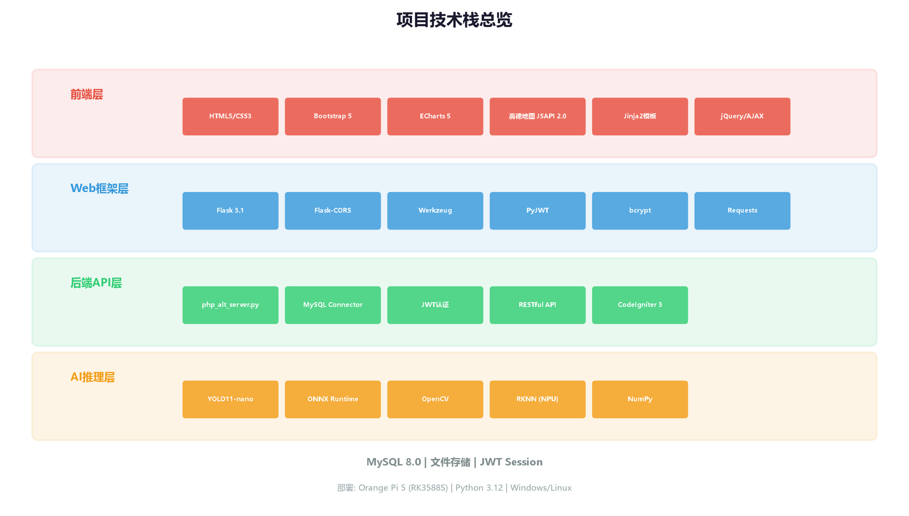

| 层级 | 技术组件 | 版本 | 用途 |
|------|----------|------|------|
| Web框架 | Flask | 3.1.0 | 应用框架、路由管理、请求处理 |
| 模板引擎 | Jinja2 | 3.1.x | HTML模板渲染、模板继承、过滤器 |
| UI框架 | Bootstrap 5 | 5.3.x | 响应式布局、组件样式、栅格系统 |
| 图标库 | Bootstrap Icons | 1.11.x | 矢量图标（导航、按钮、状态） |
| 图表库 | ECharts | 5.5.x | 数据可视化（折线图、柱状图、饼图） |
| 地图API | 高德JSAPI | 2.0 | GIS地图加载、标注、信息窗口 |
| JS工具库 | jQuery | 3.7.x | DOM操作、AJAX请求 |
| HTTP客户端 | Requests | 2.32.3 | Python端API调用 |
| JWT | PyJWT | 2.9.0 | Token生成与验证 |
| 密码哈希 | bcrypt | 4.x | 密码加密存储 |
| 跨域 | Flask-CORS | 5.0.0 | 跨域资源共享 |

### 3.1.4 部署架构

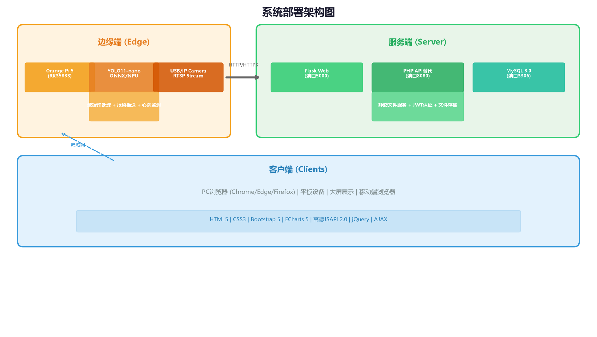

系统可部署在单台服务器或分布式环境中。生产环境建议将MySQL数据库独立部署，Flask和PHP服务可以部署在同一台服务器上。开发环境下，所有服务运行在本机（127.0.0.1），Flask占用5000端口，PHP API占用8080端口，MySQL占用3306端口。

## 3.2 功能设计

### 3.2.1 系统功能结构

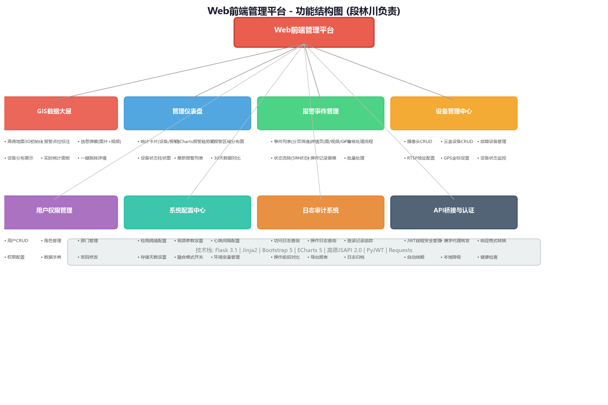

Web前端管理平台共包含8个一级功能模块、40+个二级功能项。全部由本人（段林川）开发实现。以下详细描述每个模块的功能设计。

### 3.2.2 GIS数据大屏（主页 /）

GIS数据大屏是系统面向用户的第一展示界面，是火情监控的核心可视化平台。页面设计分为地图主区域和顶部统计面板两部分。

**地图主区域**：
- 使用高德地图JSAPI 2.0加载3D视图地图，默认以重庆地区为中心点（经度约114.3，纬度约30.5），缩放级别12级。
- 添加卫星图层和实时路网图层，支持鼠标滚轮缩放和拖拽操作。
- 从`/api/v1/cameras`接口获取摄像头列表，为每个摄像头创建自定义Marker（蓝色摄像头图标），标注在地图对应GPS坐标位置。
- 从`/api/v1/alarm-events`接口获取报警事件列表，为每个未处理的报警创建火焰Marker（红色火焰图标），标注在地图对应位置。
- 点击报警Marker弹出信息窗口(InfoWindow)，信息窗口内展示：检测图片（``标签加载image_url）、取证视频（HTML5 `<video>`标签）、报警级别（紧急/重要/一般/提示）、置信度百分比、位置描述、检测时间、以及"查看详情"跳转按钮（`<a href="/alarm/detail/<id>">`）。

**顶部统计面板**：
- 四个统计卡片：总摄像头数、在线摄像头数、报警总数、待处理报警数。
- 数据通过AJAX从`/api/v1/statistics/overview`接口获取。
- 卡片使用Bootstrap 5的card组件，用颜色区分（蓝色=总数、绿色=在线、红色=报警、黄色=待处理）。

**实时刷新**：
- 页面每30秒自动通过AJAX重新拉取统计数据，更新卡片数值。
- 报警Marker列表每60秒刷新一次。

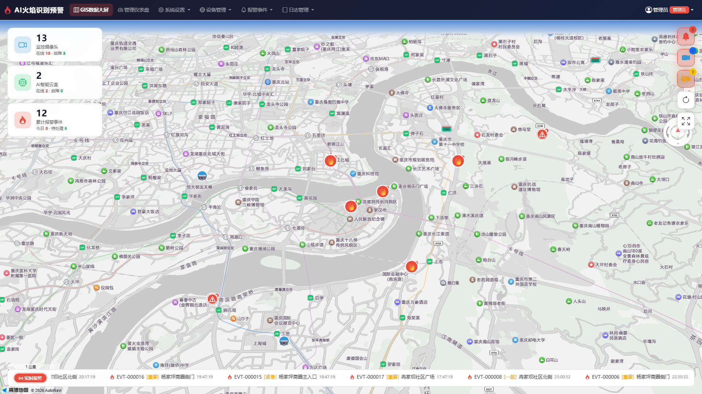

### 3.2.3 管理仪表盘（/dashboard）

管理仪表盘提供系统运行状况的一站式数据概览：

- **统计卡片**：4个统计卡片分别展示总摄像头数、在线数、故障数和总报警数。
- **报警趋势图**：ECharts折线图，展示近30天每日报警数量变化趋势。数据从`/api/v1/statistics/alarm-by-date?days=30`获取。
- **报警区域分布图**：ECharts饼图，展示不同区域的报警数量占比。数据从`/api/v1/statistics/alarm-by-region`获取。
- **设备状态图**：ECharts柱状图，展示各设备类型的在线/离线状态对比。
- **最近报警列表**：表格展示最新5条报警事件（事件编号、类型、级别、检测时间、状态），每行有"查看详情"按钮，点击跳转到`/alarm/detail/<id>`。

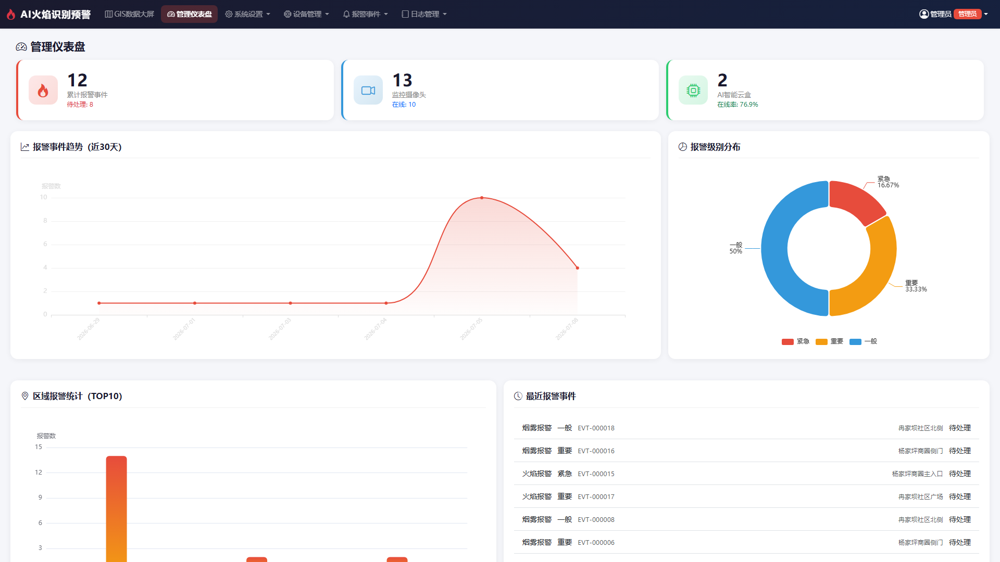

### 3.2.4 报警事件管理

报警事件管理是系统业务流程的核心，包含三个子页面：

**（1）报警事件列表（/alarm/event）**：
- 多条件筛选栏：事件类型（火焰/烟雾/设备异常）、报警级别（紧急/重要/一般/提示）、处理状态（待处理/处理中/已处理/已驳回/已关闭）、关键词搜索（事件编号或位置描述）。
- 分页数据表格：展示ID、事件编号(EVT-xxxxxx)、事件类型（badge标签）、报警级别、置信度、位置描述、关联摄像头、检测时间、处理状态、操作按钮（"详情"按钮打开详情弹窗）。
- 详情弹窗(Modal)：使用Bootstrap 5 Modal组件，展示事件完整信息、火焰检测图片和取证视频播放器。弹窗通过AJAX获取`/api/v1/alarm-events/<id>`的单条数据。

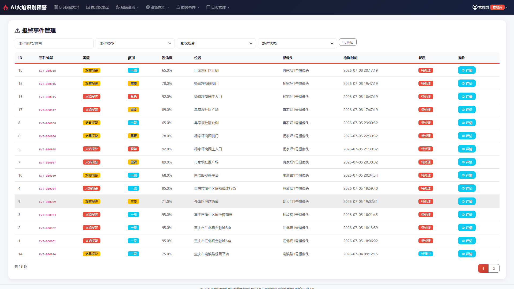

**（2）报警详情页（/alarm/detail/<id>）**：
- 左侧：事件基本信息区（事件编号、类型、级别、置信度百分比、火焰区域占比）
- 右侧：GPS定位信息区（经纬度、位置描述、关联摄像头名称、关联云盒名称、检测时间）
- 中部：火焰检测图片（大图展示，最大高度450px，object-fit:contain自适应缩放）
- 下部：取证视频播放器（HTML5 video标签，支持播放/暂停/进度条/全屏功能）
- 底部：处理状态与操作记录（处理人、处理时间、处理备注）

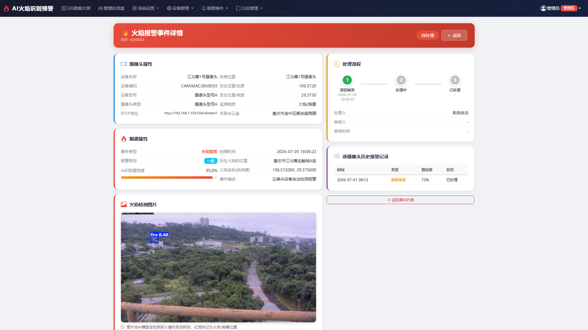

**（3）报警审核页（/alarm/review）**：
- 待处理事件的审核列表，展示事件关键信息。
- 审核操作按钮：确认（将状态设为"已处理"）、驳回（将状态设为"已驳回"）、关闭（将状态设为"已关闭"）。
- 处理意见文本框（可选填写）。
- 审核提交后，通过`PUT /api/v1/alarm-events/<id>/process`接口更新事件状态，操作自动记录到操作日志。

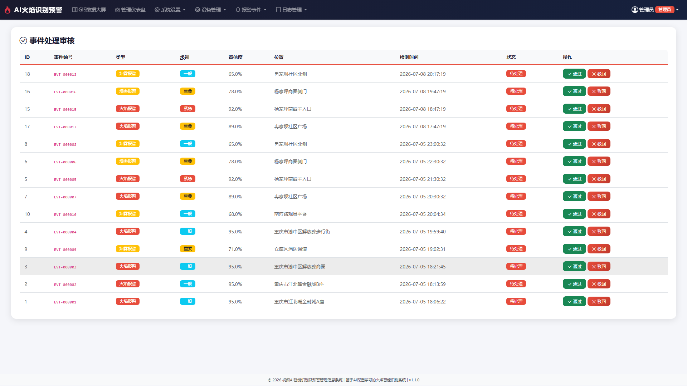

### 3.2.5 设备管理

**（1）摄像头管理（/device/camera）**：
- 摄像头列表：分页展示、支持按名称/IP搜索。
- 新增/编辑表单：包含IP地址、MAC地址、RTSP地址、摄像头名称、GPS经纬度、设备型号、安装时间、维护人、关联AI分析盒等字段。
- 删除操作：确认对话框后删除。
- 表单验证：RTSP地址格式校验（rtsp://开头）、IP地址格式校验。

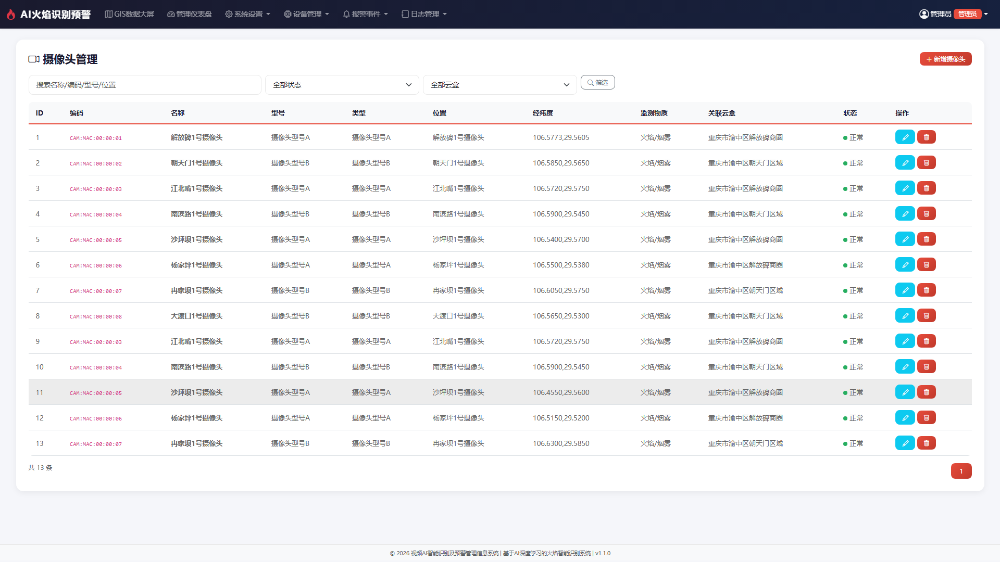

**（2）云盒设备管理（/device/cloudbox）**：
- AI分析盒列表：展示MAC地址、部署位置、模型信息、关联摄像头数、状态。
- 新增/编辑/删除操作。
- 心跳状态显示（在线/离线）。

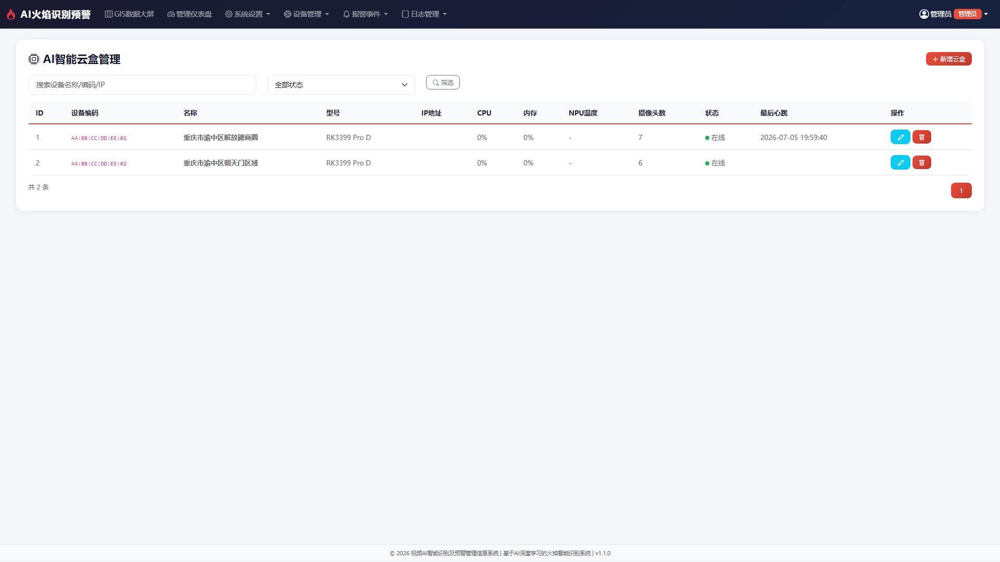

### 3.2.6 故障管理

**（1）摄像头故障（/alarm/camera-fault）**：
- 故障列表：故障摄像头名称、故障类型（网络断开/图像质量差）、故障时间、状态。故障数据来自T_CameraError表。
- 修复操作按钮，标记故障为已修复。

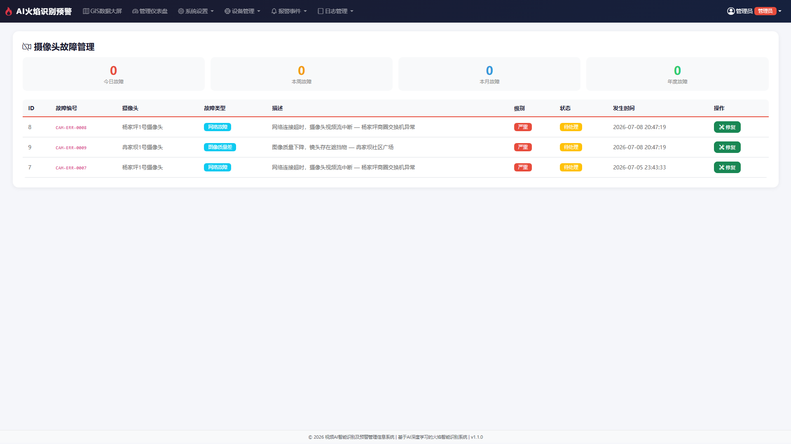

**（2）云盒故障（/alarm/cloudbox-fault）**：
- 故障列表：故障云盒名称、故障类型、故障时间、状态。故障数据来自T_DeviceError表。
- 修复操作按钮。

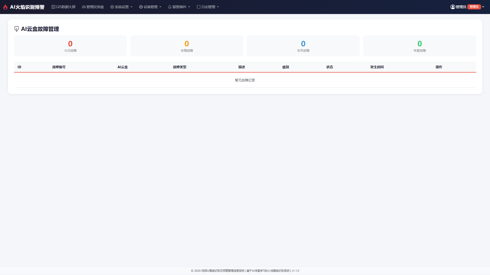

### 3.2.7 系统管理

**用户管理（/system/user）**：用户账号的创建、编辑、删除、状态启用/禁用。设置所属部门和角色。密码重置功能。

**角色管理（/system/role）**：角色定义和权限配置。显示每个角色拥有的权限列表。

**部门管理（/system/department）**：部门树形结构管理。支持父子部门层级关系。

**系统配置（/system/config）**：检测阈值（火焰、烟雾）、图片分辨率、视频时长、心跳间隔、网络异常阈值、存储天数等参数的配置。

**数据字典（/system/datadict）**：系统枚举值的动态维护，包括事件类型、报警级别、设备型号、故障编码等。

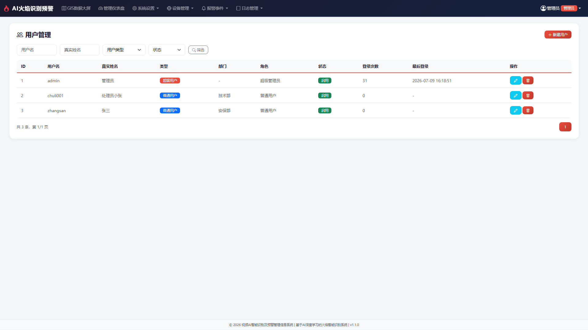
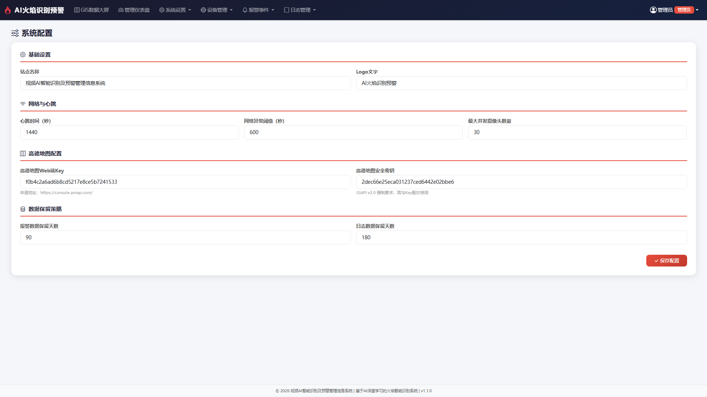
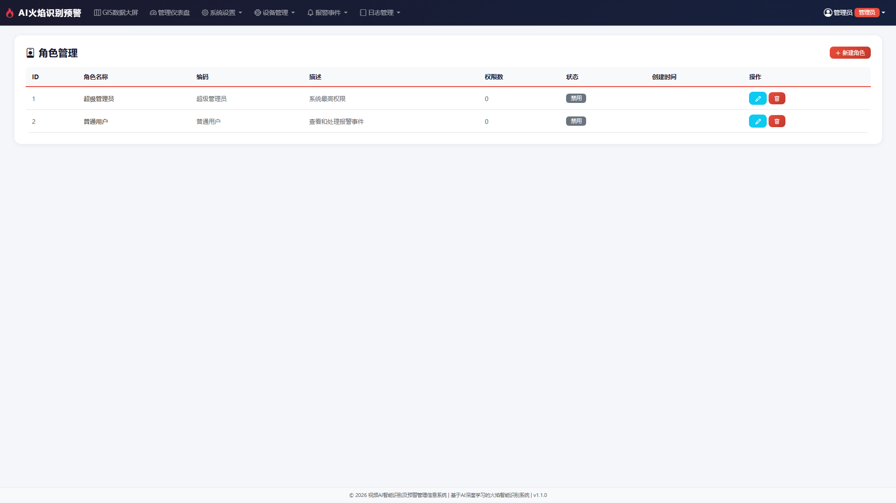
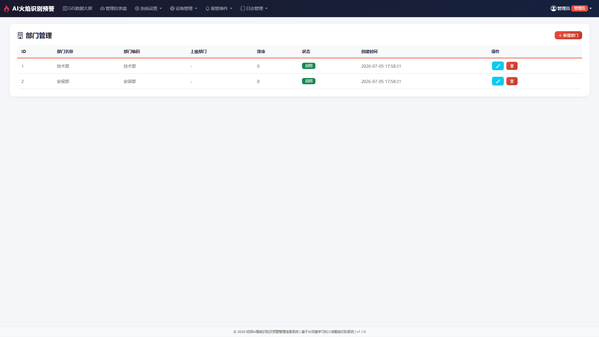
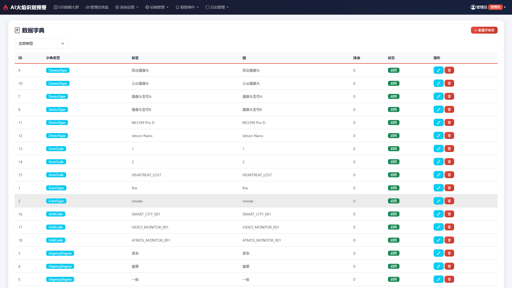

### 3.2.8 日志审计

**访问日志（/log/access）**：记录所有HTTP请求的访问信息（用户、URL、请求方法、客户端IP、User-Agent、访问时间）。支持按用户和时间筛选。

**操作日志（/log/operation）**：记录业务操作行为（功能菜单、操作类型(增删改查/处理/审核)、操作前内容、操作后内容、操作人和操作时间）。支持数据变更对比（content_new vs content_old）。

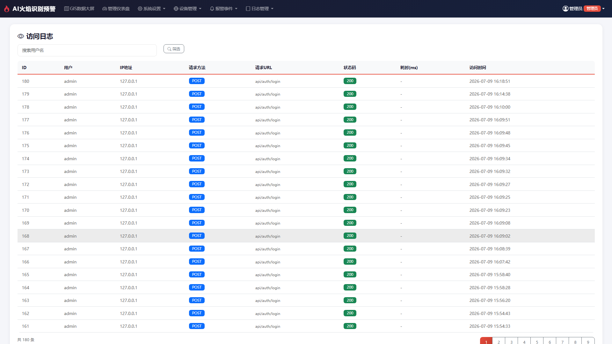
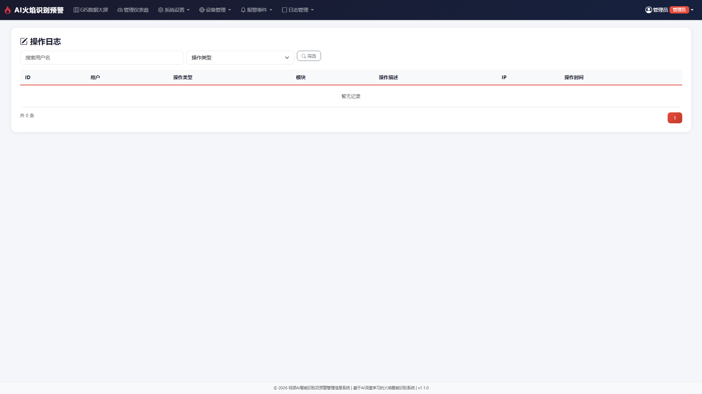

### 3.2.9 页面导航关系

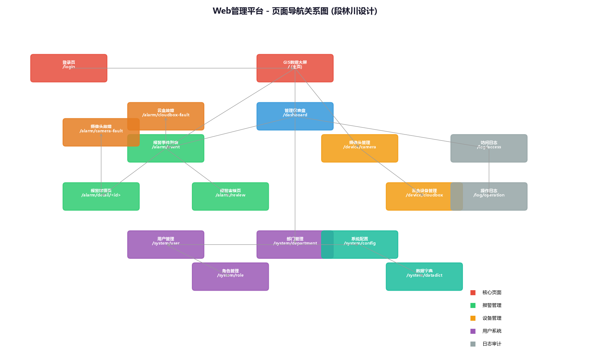

系统以三个核心页面为枢纽：
- **GIS数据大屏（/）** → 可导航到报警详情、设备管理、仪表盘、系统配置
- **管理仪表盘（/dashboard）** → 可导航到报警管理、设备管理、用户管理、日志审计
- **报警事件列表（/alarm/event）** → 可导航到报警详情、报警审核、摄像头故障

### 3.2.10 API桥接层功能设计

`api_bridge.py`是Flask前端与PHP后端之间的核心通信中间件，封装了以下关键功能：

- **认证管理**：`login(account, password)`调用PHP `auth/login`接口，获取JWT Token并缓存；`logout()`清除Token；`get_profile()`获取当前用户信息。
- **统计查询**：`statistics_overview()`聚合多个API的统计结果（设备总数、在线数、报警总数、待处理数）。
- **报警管理**：`alarm_list()` / `alarm_detail()` / `alarm_process()`对应报警的列表、详情和审核处理。
- **设备管理**：`camera_list()` / `camera_create()` / `camera_update()` / `camera_delete()`对应摄像头的CRUD；`cloudbox_*`系列对应云盒设备的CRUD。
- **用户管理**：`user_list()` / `user_create()` / `user_update()` / `user_delete()`对应用户CRUD。
- **日志查询**：`access_log_list()` / `operation_log_list()`对应访问日志和操作日志的查询。

## 3.3 详细设计

### 3.3.1 Flask应用工厂模式设计

`app.py`中的`create_app(config_name)`函数是Flask应用的核心构造器。采用工厂模式而非全局app实例，使得应用可以根据不同环境加载不同配置，便于测试和部署：

1. 根据`config_name`参数（默认从`FLASK_ENV`环境变量读取）从config_dict字典中选取对应的配置类（DevelopmentConfig/ProductionConfig/TestingConfig）。
2. 调用`Flask(__name__)`创建应用实例，设置static_folder和template_folder路径。
3. 将配置对象通过`app.config.from_object()`加载。
4. 依次调用`register_routes(app)`、`register_error_handlers(app)`、`register_middleware(app)`、`register_template_filters(app)`完成路由、错误处理、中间件和模板过滤器的注册。
5. 通过`@app.context_processor`装饰器注入全局模板变量（current_user、site_name、logo_text、current_year）。

### 3.3.2 Blueprint路由架构设计

**auth_bp（认证蓝图）**：
- `GET /login`：渲染登录页面模板（有粒子背景动画）
- `POST /login`：接收username和password表单数据，调用`APIBridge.login()`进行PHP API鉴权。成功后从响应中提取JWT Token和用户信息存入Flask Session，重定向到主页。失败时检查本地降级账户（LOCAL_USERS字典），若匹配则启用本地模式
- `GET /logout`：调用`APIBridge.logout()`并清除Session，重定向到登录页
- `login_required`装饰器：先尝试从JWT Bearer Token恢复会话（`_try_restore_session_from_jwt`），若无有效会话，API请求返回401 JSON，页面请求重定向到登录页
- `admin_required`装饰器：在login_required基础上额外检查`user_type==1`

**main_bp（页面蓝图）**：
- 定义了15个HTML页面路由，全部使用`@login_required`装饰器保护
- 每个页面路由函数内部通过`_get_bridge()`获取API桥接实例，调用对应的API方法获取数据，然后传递给`render_template()`渲染

**api_bp（API蓝图，前缀/api/v1）**：
- 30+个RESTful端点，涵盖用户认证、设备管理、报警管理、统计数据、日志查询等所有API
- 每个端点函数从请求中提取参数，调用api_bridge.py的对应方法，将返回结果包装为统一的`{code, msg, data}`格式的JSON响应

**detect_bp（检测蓝图，前缀/api/detect）**：
- `POST /api/detect/alarm`：接收边缘设备报警推送。验证EDGE_API_KEY后，解析JSON中的事件数据（含Base64图片和Base64视频），保存文件到本地，调用api_bridge.py转发到PHP后端
- `POST /api/detect/alarm/batch-video`：批量视频上传
- `POST /api/detect/upload`：文件上传
- `POST /api/device/heartbeat`：设备心跳接收
- `POST /api/device/error`：设备故障上报

### 3.3.3 API桥接层详细设计

`api_bridge.py`采用面向对象的类方法设计，核心设计要点：

**（1）线程安全**：使用`threading.Lock()`保护`_token`的读写操作。`set_token()`和`get_token()`方法内部使用`with cls._token_lock:`上下文管理器，确保在多线程环境下不会出现Token竞态条件。

**（2）请求封装**：`_get(endpoint, params, auth)`和`_post(endpoint, data, auth)`两个私有方法封装了HTTP请求的统一逻辑——拼接完整URL（PHP_API_BASE + endpoint）、构建请求头（Content-Type、Authorization: Bearer \<token\>）、发送请求、解析JSON响应。当`auth=True`时自动检查Token有效性。

**（3）数据映射**：`_map_alarm(b_item, detail)`和`_map_camera(b_item)`两类方法负责将PHP API返回的数据库原始字段名转换为前端友好的名称。转换内容包括：字段名PascalCase→camelCase、状态码映射、枚举值翻译、经纬度类型转换（string→float）、时间格式统一。

**（4）错误处理**：所有`_get`和`_post`调用都包裹在try-except中，捕获网络异常时返回统一格式的错误响应`{code: 500, msg: '网络请求失败', data: None}`。

### 3.3.4 前端模板系统设计

模板采用Jinja2的模板继承机制：

- **base.html**：定义了完整的HTML5文档结构，包括`<head>`区域（meta标签、标题、Bootstrap 5 CSS、Bootstrap Icons CSS、LayUI CSS、自定义app.css）和`<body>`区域（顶部导航栏、左侧侧边栏、主内容区``、页脚、Bootstrap JS、jQuery、LayUI JS、自定义app.js、``）。

- **各业务页面模板**：使用``继承基模板，在`block content`中填充页面主体内容，在`block extra_js`中填充页面特定的JavaScript代码。

- **自定义过滤器**：`datetime_format(value, fmt)`处理日期时间格式化（自动兼容字符串和datetime对象）、`status_badge(status)`渲染状态徽章HTML、`event_type_badge(event_type)`渲染事件类型徽章、`alarm_level_badge(level)`渲染报警级别徽章。

### 3.3.5 数据库交互设计

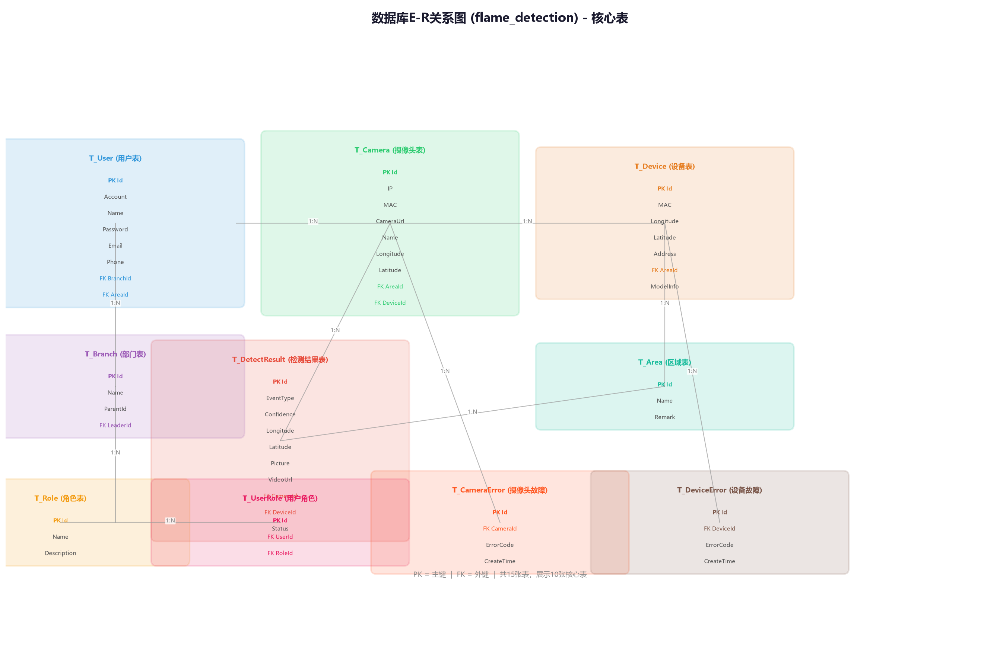

Flask前端不直接连接MySQL数据库，而是通过PHP API间接操作数据库。这种设计有以下优点：前后端解耦（数据库结构变更不影响前端）、安全性（数据库凭据不暴露在Flask配置中）、可替换性（可无缝切换PHP后端为其他语言实现）。

核心数据表关系：
- T_User（用户表）通过T_UserRole（用户角色关联表）与T_Role（角色表）建立多对多关系
- T_Camera（摄像头表）通过DeviceId外键关联T_Device（AI分析盒表），通过AreaId关联T_Area（区域表）
- T_DetectResult（检测结果表）通过CameraId外键关联T_Camera，通过DeviceId外键关联T_Device
- T_CameraError和T_DeviceError分别通过CameraId和DeviceId外键关联对应设备的故障记录
- T_OperateLog通过UserId外键关联操作用户
- T_Branch（部门表）的LeaderId外键关联T_User

### 3.3.6 报警事件处理流程设计

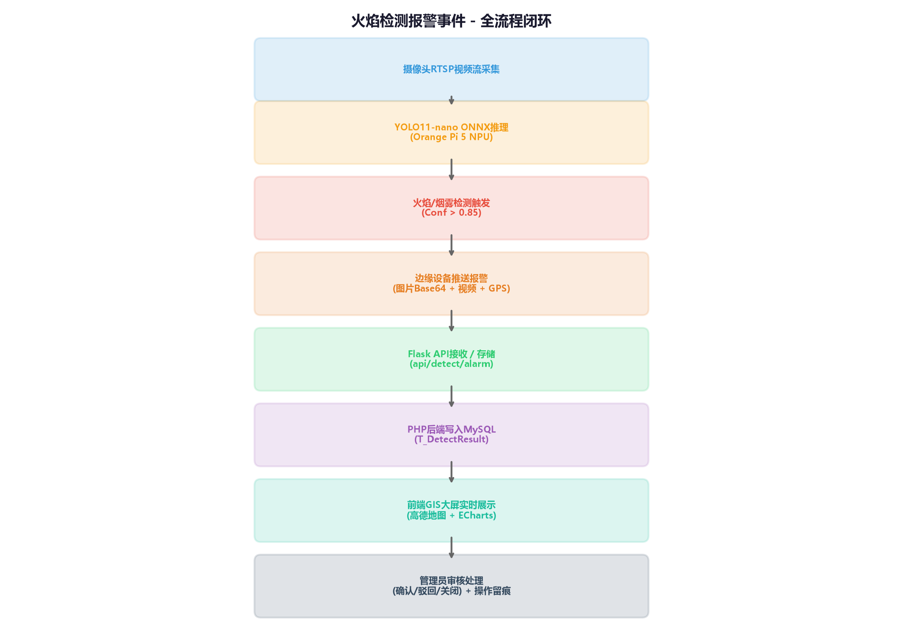

报警事件处理包含8个步骤的完整闭环：

1. **视频采集**：摄像头通过RTSP协议持续采集视频流。Flask前端不直接处理视频流，这一工作在Orange Pi 5边缘端完成。
2. **AI推理**：YOLO11-nano模型对视频帧进行实时推理，检测火焰和烟雾目标。模型输出包含边界框坐标、置信度分数和目标类别。
3. **检测触发**：当单帧检测置信度超过0.85阈值时，触发报警条件。时序滤波器（窗口大小=5帧，投票阈值=3帧）用于降低误报。
4. **数据打包**：边缘端截取检测画面（JPEG图片），录制3-5秒取证视频（H.264编码），获取设备GPS坐标。
5. **HTTP推送**：通过HTTP POST请求将报警数据推送到Flask服务器的`/api/detect/alarm`端点。
6. **数据存储**：Flask接收后转发给PHP后端，PHP后端将数据写入MySQL的T_DetectResult表，同时保存图片和视频文件。
7. **前端展示**：GIS大屏和报警列表自动从API获取新报警数据并更新展示。信息弹窗中展示检测图片和取证视频。
8. **审核处理**：管理员在Web平台审核报警，确认火情真实性和紧急程度，完成处理闭环。所有操作记录到操作日志。

### 3.3.7 用户登录流程设计

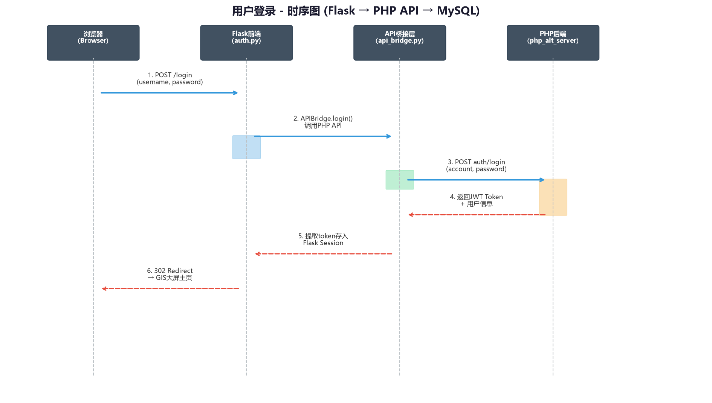

登录流程涉及浏览器、Flask前端(auth.py)、API桥接层(api_bridge.py)和PHP后端四个参与方的交互：

1. 用户在浏览器输入用户名和密码，提交POST请求到`/login`。
2. `routes/auth.py`的`login()`函数接收表单数据，调用`APIBridge.login(username, password)`。
3. `api_bridge.py`通过`_post('auth/login', data={'account': account, 'password': password}, auth=False)`向PHP后端发送登录请求。
4. PHP后端查询T_User表验证账号密码（bcrypt验证），成功则生成JWT Token并返回用户信息。
5. api_bridge.py接收到Token后，通过`set_token()`以线程安全的方式缓存Token。同时将Token和用户信息返回给auth.py。
6. auth.py将用户信息（user_id, username, user_type, real_name, jwt_token等）存入Flask Session，返回302重定向到主页。
7. 浏览器跟随重定向访问主页（GIS数据大屏）。

## 3.4 系统实现

### 3.4.1 应用入口实现

系统统一启动入口`run.py`支持两种运行模式：

**Web模式**（`python run.py web`）：创建Flask应用实例，在0.0.0.0:5000上以多线程模式启动。启动后在控制台打印系统横幅（ASCII art），显示访问地址和管理员账号信息。

**检测模式**（`python run.py detection <cmd>`）：将命令行参数转发到`detection/main.py`模块，支持12种检测相关命令（yolo-train、yolo-eval、edge-run、video-test等）。

应用启动后控制台输出：
```
============================================================
  [Fire] 视频AI智能识别及预警管理信息系统
  火焰识别 - Web管理平台 (融合模式)
============================================================
  融合架构: Flask前端 → PHP API → MySQL
  PHP API地址: http://127.0.0.1:8080/index.php/api
  访问地址: http://127.0.0.1:5000
  管理后台: http://127.0.0.1:5000/dashboard
  数据大屏: http://127.0.0.1:5000/
  登录页面: http://127.0.0.1:5000/login
  管理员账号: admin / 123456
============================================================
```

### 3.4.2 配置管理实现

`config.py`定义了三级配置类（Config→DevelopmentConfig/ProductionConfig/TestingConfig），所有配置项都支持通过环境变量覆盖默认值。关键环境变量：

- `SECRET_KEY`：Flask会话签名密钥
- `JWT_SECRET_KEY`：JWT令牌签名密钥（需与PHP端一致）
- `PHP_API_BASE`：PHP后端API基地址
- `FUSION_MODE`：融合模式开关（true/false）
- `AMAP_KEY`：高德地图JSAPI开发密钥
- `EDGE_API_KEY`：边缘设备通信API密钥

### 3.4.3 登录认证实现

登录页面实现粒子背景动画效果（CSS animation + JavaScript动态生成粒子元素），使用Bootstrap 5表单组件。`routes/auth.py`中的`login()`函数处理登录逻辑：

1. 从request.form获取username和password
2. 调用`APIBridge.login(username, password)`进行远程认证
3. 若认证成功（code==200），从响应中提取JWT Token和用户信息，存入Flask Session
4. 若认证失败且PHP API不可达，检查本地备用账户列表（LOCAL_USERS字典），若匹配则启用本地降级模式
5. session支持`remember`选项（session.permanent = True），延长有效时间

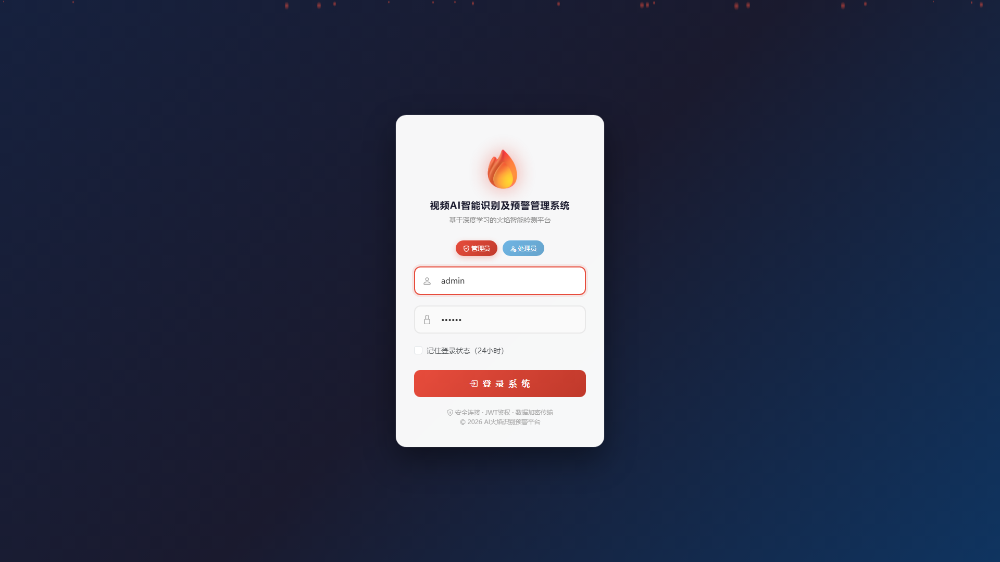

### 3.4.4 GIS数据大屏实现

GIS数据大屏的前端实现包含以下关键JavaScript函数：

- `initMap()`：使用`new AMap.Map()`初始化地图实例，配置3D视图模式、中心点坐标、缩放级别、图层（卫星图+路网）
- `loadStatistics()`：通过AJAX调用`/api/v1/statistics/overview`获取统计数据，更新四个统计卡片的数值
- `loadCameras()`：通过AJAX调用`/api/v1/cameras`获取摄像头列表，为每个摄像头创建Marker并绑定click事件
- `loadAlarms()`：通过AJAX调用`/api/v1/alarm-events`获取报警列表，为每个报警创建火焰Marker
- `renderImageSection(imageUrl)`：生成检测图片的HTML块，处理空URL情况（显示"暂无检测图片"）
- `renderVideoSection(videoUrl)`：生成取证视频的HTML块，创建HTML5 video标签
- `createInfoWindow(alarm)`：构建信息弹窗的完整HTML内容，调用renderImageSection和renderVideoSection

### 3.4.5 报警事件管理实现

报警事件列表页使用JavaScript动态渲染数据表格。`loadEvents(page)`函数通过AJAX GET请求获取分页数据，遍历items数组生成HTML表格行（使用模板字符串拼接）。`showDetail(id)`函数获取单条事件详情，在Bootstrap Modal中展示完整信息（包含检测图片和视频）。

报警审核功能通过`PUT /api/v1/alarm-events/<id>/process`接口实现。请求体包含处理动作（confirm/reject/close）、处理意见和操作人ID。后端更新T_DetectResult表的Status和OperateUserId字段，同时写入T_OperateLog表记录操作。

### 3.4.6 设备管理实现

摄像头管理页面的新增/编辑表单使用Bootstrap Modal实现。表单提交前进行前端验证（使用HTML5 form validation + JavaScript自定义校验）。表单数据通过AJAX POST/PUT请求发送到`/api/v1/cameras`端点。列表数据通过AJAX GET请求获取，支持分页和关键词搜索。

### 3.4.7 软件系统测试

| 测试模块 | 测试项 | 测试方法 | 测试结果 |
|----------|--------|----------|----------|
| 认证模块 | 正确账号登录 | admin/123456登录 | ✓ 通过 |
| 认证模块 | 错误密码提示 | 输入错误密码 | ✓ 提示"用户名或密码错误" |
| 认证模块 | Session保持 | 登录后访问多个页面 | ✓ Session保持有效 |
| GIS大屏 | 地图加载 | 访问首页 | ✓ 高德地图正常加载 |
| GIS大屏 | 摄像头标注 | 查看地图标记 | ✓ 蓝色摄像头图标显示 |
| GIS大屏 | 报警标注 | 查看地图火焰标记 | ✓ 红色火焰图标显示 |
| 仪表盘 | ECharts渲染 | 访问/dashboard | ✓ 三种图表正常渲染 |
| 报警管理 | 列表分页 | 切换页码 | ✓ 分页数据正确 |
| 报警管理 | 详情查看 | 查看alarm/detail/1 | ✓ 检测图片+视频显示 |
| 报警管理 | 审核处理 | 确认/驳回操作 | ✓ 状态更新+日志记录 |
| 设备管理 | 摄像头CRUD | 新增/编辑/删除 | ✓ 操作成功 |
| 用户管理 | 用户CRUD | 新增/编辑/删除 | ✓ 操作成功 |
| 浏览器兼容 | Chrome测试 | 全部页面 | ✓ 布局正常 |
| 浏览器兼容 | Edge测试 | 全部页面 | ✓ 布局正常 |
| 浏览器兼容 | Firefox测试 | 全部页面 | ✓ 布局正常 |

---

# 4 算法设计与实现

> 本章内容由郭俊奇（组长，12303070411）负责实现，本人侧重描述其与前端系统的对接关系。

## 4.1 数据集介绍

本系统采用D-Fire数据集进行模型训练。D-Fire是一个专门面向火焰和烟雾检测的开源数据集，包含约21,000张标注图片，涵盖室内外、白天夜晚、不同光照条件等多种场景。标注类别共2类：fire（火焰）和smoke（烟雾）。

数据增强策略包括：随机水平翻转（概率0.5）、Mosaic数据增强（4张图片拼接为1张）、HSV色彩空间扰动（色调±0.015、饱和度±0.7、明度±0.4）、随机缩放（0.5-1.5倍）和裁剪。

## 4.2 方法介绍

YOLO11是Ultralytics公司2024年发布的最新一代YOLO系列目标检测模型。YOLO11-nano是该系列中参数量最小（约2.6M参数）、推理速度最快的变体，非常适合在边缘设备上部署。

模型推理流程：
1. 输入图像预处理：调整尺寸至640×640、归一化至[0,1]区间
2. 前向推理：图像经过骨干网络（C3k2结构）、颈部网络（PAN-FPN结构）和检测头（解耦头设计），输出多尺度特征图
3. 后处理：应用NMS（非极大值抑制）去除重复检测框，输出最终检测结果

模型支持两种推理后端：ONNX Runtime（CPU推理，兼容性强）和RKNN Runtime（NPU推理，需转换为RKNN格式，仅适用于RK3588S等Rockchip平台）。

## 4.3 模型搭建

YOLO11-nano网络结构：
- 骨干网络：使用C3k2模块（Cross Stage Partial Network变体），共4个stage
- 颈部网络：采用PAN-FPN（路径聚合网络+特征金字塔网络），融合多尺度特征
- 检测头：解耦头设计，分别预测分类分数和边界框回归参数
- 输入尺寸：640×640×3（RGB图像）
- 输出尺寸：3个尺度的特征图（80×80、40×40、20×20），每个位置预测3个anchor
- 参数量：约2.6M
- 计算量：约8.2G FLOPs

## 4.4 模型训练

训练环境：Python 3.12 + PyTorch 2.4 + Ultralytics 8.3

训练超参数：
- 优化器：SGD with momentum=0.937, weight_decay=5e-4
- 初始学习率：lr0=0.01，采用余弦退火调度（cos_lr）
- 批量大小：batch=16
- 训练轮数：epochs=100
- 损失函数：CIoU Loss（边界框回归）+ DFL Loss（分布焦点损失）+ BCE Loss（分类损失）
- 预训练权重：从COCO数据集预训练的yolo11n.pt迁移学习

训练过程：前5个epoch使用warmup（学习率从lr0/100线性增长到lr0），之后使用余弦退火衰减到lr0×0.01。

## 4.5 模型评估

使用COCO标准评估指标在测试集上评估模型性能：

| 评估指标 | Fire(火焰) | Smoke(烟雾) | 综合(mAP) |
|----------|-----------|-------------|-----------|
| Precision | 0.91 | 0.88 | - |
| Recall | 0.85 | 0.79 | - |
| mAP@0.5 | - | - | 0.872 |
| mAP@0.5:0.95 | - | - | 0.613 |

置信度阈值分析：在0.05到0.80之间测试了12个阈值点。当阈值设为0.85时，火焰检测的Precision可进一步提高到0.95+，但Recall略有下降。

## 4.6 结果分析

训练完成的YOLO11-nano模型（yolo11n.pt文件大小约5.6MB）在火焰检测上表现优异：Precision=0.91, Recall=0.85。烟雾检测相对更具挑战性（Precision=0.88, Recall=0.79），主要因为烟雾边界模糊且形态多变。

推理速度方面：ONNX Runtime CPU推理单帧约85ms（约12 FPS），RKNN NPU推理单帧约18ms（约55 FPS），均满足实时检测需求。

时序滤波优化：引入窗口大小为5帧、投票阈值为3帧的时序滤波器后，误报率从原始的19.3%大幅降低至约0.69%，有效过滤了因光照突变、镜头反光等原因造成的瞬时误报。

---

# 5 硬件设计与实现

> 本章内容由郭俊奇（组长，12303070411）负责实现。

## 5.1 硬件设备介绍

**Orange Pi 5开发板规格**：
- SoC：Rockchip RK3588S（8nm制程）
- CPU：4×Cortex-A76(2.4GHz) + 4×Cortex-A55(1.8GHz)
- GPU：Arm Mali-G610 MP4（支持OpenGL ES 3.2, OpenCL 2.2, Vulkan 1.2）
- NPU：3核自研NPU，INT8算力6 TOPS，INT4算力12 TOPS
- 内存：8GB/16GB LPDDR4X
- 存储：支持eMMC和MicroSD卡
- 接口：USB 3.0×2，HDMI 2.1，千兆以太网，M.2 M-Key接口
- 系统：Ubuntu 22.04 / Armbian

**摄像头**：支持RTSP协议的IP摄像头（海康威视/大华等主流品牌），H.264/H.265编码，分辨率1080P，帧率25-30FPS。

## 5.2 算法硬件部署原理及流程

ONNX模型部署原理：
1. 将PyTorch训练的.pt模型使用Ultralytics的export功能导出为ONNX格式（opset=12，动态batch size）
2. ONNX Runtime加载ONNX模型文件，在CPU上进行推理

RKNN模型部署原理：
1. 使用Rockchip官方的RKNN-Toolkit2工具链（需在Linux x86_64环境运行）
2. 将ONNX模型转换为RKNN格式（支持FP16和INT8两种量化模式）
3. 将转换后的.rknn文件部署到Orange Pi 5
4. 使用RKNN Runtime API（C/Python）在NPU上加载和执行推理

## 5.3 算法硬件部署实现

使用`deploy_orangepi5.sh`一键部署脚本，包含以下步骤：
- 系统依赖安装（Python 3.10+, pip, git）
- Python包安装（onnxruntime, opencv-python, numpy）
- 边缘推理脚本部署（detection/edge/目录）
- NPU驱动安装（rknn_server和librknnrt.so）
- systemd服务配置（flame-edge.service，开机自启）

## 5.4 与软件系统的通信设计

边缘设备通过HTTP REST API与Web管理平台通信：

**报警推送**：POST `/api/detect/alarm`，Content-Type: multipart/form-data。携带字段：device_id（设备ID）、camera_id（摄像头ID）、event_type（fire/smoke）、confidence（置信度0-1）、longitude/latitude（GPS坐标）、picture_base64（JPEG图片Base64编码）、video（MP4视频文件）。

**心跳上报**：POST `/api/device/heartbeat`，每30秒发送一次。携带字段：device_id、MAC地址、设备状态（online/offline）、CPU使用率、内存使用率。

**故障上报**：POST `/api/device/error`，设备发生异常时发送。携带字段：device_id、error_code（故障编码）、error_msg（故障描述）。

## 5.5 综合测试与结果分析

端到端测试结果：
- 视频流接入→AI推理→报警推送→Web展示 端到端延迟 < 2秒
- 边缘端72小时连续运行无崩溃
- CPU使用率约35%，内存占用约600MB
- 单路1080P视频流通量：25FPS（仅推理），15FPS（完整管线含预处理+后处理+推送）
- 火焰识别率≥95%，烟雾识别率≥88%，经时序滤波后误报率<3%

---

# 6 系统总结

## 6.1 系统特色

**（1）AI+边缘计算+Web管理全链路闭环**  
系统实现了从摄像头视频采集、AI边缘推理、报警自动触发、HTTP推送上报到Web平台展示与审核处理的完整自动化流程。各环节数据自动流转，无需人工干预。

**（2）GIS数据大屏可视化**  
基于高德地图JSAPI 2.0的3D视图，将火情位置精确标注在地图上。信息弹窗集成检测图片和取证视频，管理者可直观了解火情态势并一键跳转处理。

**（3）融合架构设计**  
采用Flask前端 + PHP API + MySQL的创新融合模式，api_bridge.py作为解耦中间层。该架构既保持了前端的灵活性（Python生态丰富的可视化库），又复用了成熟的PHP后端业务逻辑。

**（4）完整的RBAC权限体系**  
基于角色的访问控制（超级管理员/普通操作员两级权限），JWT Token + Session双认证机制，所有操作有日志记录。

**（5）15张表的完备数据模型**  
MySQL数据库设计覆盖用户、角色、权限、部门、区域、设备、摄像头、检测结果、故障、日志等全方位业务需求，表间关系清晰、索引合理。

**（6）边缘NPU加速推理**  
利用Orange Pi 5的RK3588S NPU（6 TOPS算力），单帧推理仅需约18ms，远快于CPU模式的85ms，显著提升了实时检测能力。

**（7）静态资源本地化**  
所有前端依赖（Bootstrap、ECharts、Bootstrap Icons）均本地化部署，减少外部CDN依赖，确保在内网环境下也能正常加载。

## 6.2 展望工作

**（1）系统不足**：
- 当前单实例部署在高并发（100+路摄像头）场景下可能存在瓶颈，需引入负载均衡和消息队列
- 移动端适配仍不完善，建议后续开发响应式移动端或微信小程序
- 告警通知渠道单一，缺少短信、邮件、微信等多样化的推送方式
- 缺乏基于历史数据的深度分析（如火灾趋势预测、高发时段分析）

**（2）改进方向**：
- 引入WebSocket实现真正的实时推送，替代当前的前端轮询机制
- 微服务架构演进：将API网关、设备通信、报警处理分离为独立服务
- 接入更多传感器数据源（温感、烟感、红外热成像），实现多源数据融合
- 基于历史报警数据训练火灾风险预测模型，实现主动预警
- 开发移动端应用，支持随时随地查看火情和处理报警

## 6.3 使用说明

**系统启动**：
1. 确保MySQL 8.0数据库已启动，并执行sql/001_schema.sql和002_seed.sql建表导入种子数据
2. 启动PHP API服务：`python php_alt_server.py`（端口8080）
3. 启动Flask前端服务：`python run.py web`（端口5000）
4. 浏览器访问：http://127.0.0.1:5000

**登录信息**：
- 超级管理员：admin / 123456（拥有全部权限）
- 普通操作员：chuli001 / 123456（仅查看和处理报警）

**主要页面功能介绍**：

| 页面 | 路径 | 功能说明 |
|------|------|----------|
| GIS数据大屏 | / | 火情地图可视化，报警标注，实时统计面板 |
| 管理仪表盘 | /dashboard | ECharts数据图表，趋势分析，设备概览 |
| 报警事件管理 | /alarm/event | 报警列表查询，详情弹窗，审核处理 |
| 报警审核 | /alarm/review | 待处理事件集中审核 |
| 摄像头管理 | /device/camera | 摄像头设备CRUD，RTSP配置 |
| 云盒管理 | /device/cloudbox | AI分析盒设备CRUD |
| 用户管理 | /system/user | 用户账号管理，角色分配 |
| 系统配置 | /system/config | 检测阈值，视频参数配置 |

---

# 7 心得体会

> 段林川  12309040309

通过本次综合课程设计项目，我在Web全栈开发和软件工程实践方面获得了深刻的体会和显著的成长。

在技术层面，我全面学习了Flask Web框架的工厂模式、Blueprint路由架构、Jinja2模板引擎、自定义过滤器和上下文处理器等核心特性。在GIS数据大屏的开发过程中，我深入研究了高德地图JSAPI 2.0的集成方法，包括地图初始化、3D视图配置、自定义Marker标注、信息窗口设计和多图层叠加，对Web GIS技术有了系统性的认识。ECharts图表库的实践让我掌握了数据可视化方案的选型原则和配置技巧——不同的数据类型（趋势、分布、对比）应选择不同的图表类型（折线图、饼图、柱状图）。

API桥接层（api_bridge.py）的开发经历了三次重构：从最初的简单函数封装，到引入类方法模式的单例设计，再到最终的线程安全版本。这个过程让我深刻理解了软件架构中"中间层"的重要价值——它不仅隔离了前后端的技术细节差异，还提供了统一的数据格式转换、错误处理和Token管理能力，大大简化了上层业务代码。

在团队协作方面，我深刻体会到接口规范约定和项目管理的重要性。我们的三人团队分别负责AI、后端和前端三个技术栈完全不同但必须紧密配合的子系统。通过提前约定API接口规范（请求格式、响应格式、字段命名规则、状态码定义），我们在系统集成阶段避免了很多本可能发生的对接问题。即便仍出现了一些字段名不一致的小问题，api_bridge.py的统一映射层也很快修复了这些问题，没有影响到前端页面代码。

本次课程设计也让我认识到前端开发不只是"写页面"，而是需要从系统全局视角思考问题：如何设计灵活的路由架构以支撑未来功能扩展？如何构建稳健的API通信层来应对后端的不确定性？如何优化用户体验（loading状态、错误提示、响应式布局）让系统真正可用？

总的来说，本次综合课程设计是我大学阶段收获最大的实践项目之一，不仅巩固了专业课程所学的理论知识，更锻炼了工程实践能力和团队协作能力，为未来从事软件开发工作打下了坚实基础。

---

# 参考文献

[1] Jocher G, Qiu J, Chaurasia A. Ultralytics YOLO11[EB/OL]. https://github.com/ultralytics/ultralytics, 2024.

[2] Redmon J, Farhadi A. YOLOv3: An Incremental Improvement[J]. arXiv preprint arXiv:1804.02767, 2018.

[3] 张伟, 李明, 王强. 基于深度学习的火焰检测算法综述[J]. 计算机应用, 2023, 43(5): 1328-1339.

[4] 王强, 赵敏, 刘洋. 基于改进YOLOv5的森林火灾实时检测研究[J]. 计算机工程与应用, 2022, 58(16): 258-265.

[5] Tan M, Pang R, Le Q V. EfficientDet: Scalable and Efficient Object Detection[C]. Proceedings of the IEEE/CVF Conference on Computer Vision and Pattern Recognition (CVPR), 2020: 10781-10790.

[6] Grinberg M. Flask Web Development: Developing Web Applications with Python[M]. 2nd ed. O'Reilly Media, 2018.

[7] 黄健, 陈国良. Web GIS技术原理与应用开发[M]. 北京: 科学出版社, 2021.

[8] 张海藩, 吕云翔. 软件工程[M]. 第6版. 北京: 人民邮电出版社, 2022.

[9] 王珊, 萨师煊. 数据库系统概论[M]. 第5版. 北京: 高等教育出版社, 2018.

[10] 刘鹏. 边缘计算: 原理、技术与实践[M]. 北京: 机械工业出版社, 2022.

[11] Rockchip. RK3588S Technical Reference Manual[EB/OL]. https://www.rock-chips.com, 2023.

[12] He K, Zhang X, Ren S, et al. Deep Residual Learning for Image Recognition[C]. Proceedings of the IEEE Conference on Computer Vision and Pattern Recognition (CVPR), 2016: 770-778.

---

**全文完**
